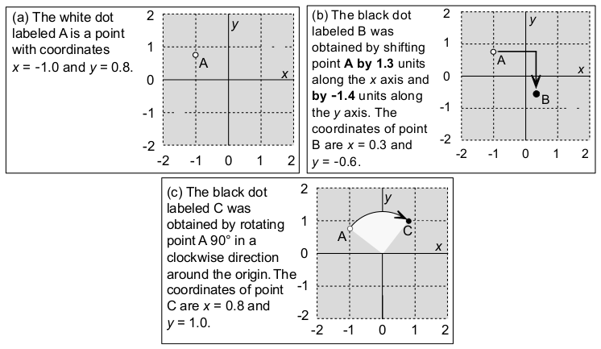

[\<- 01/12](01-12.md)

### Header Files

- What's the problem below?
- What's the solution

```
//file "a.h"
class foo
{
	...
};
```

```
//file "b.h"
#include "a.h"
```

```
//file "c.c"
#include "a.h"
#include "b.h"
```

- Problem: `a.h` is included twice
- Solutions
	- One (kinda bad) solution is to not include `a.h` in `c.c`
	- A better solution is to provide namespace

### Namespace

- Namespaces provide method for preventing name conflicts in large project
- A namespace is a name that a programmer selects to identify a portion of the her work
- A single namespace, such as `scu_coen79_2`, may have several different namespace groupings
	- e.g. one for class definition, one for implementation

```
namespace scu_coen79_2
{
	//any item that belongs to the namespace is written here
}
```

### Global Namespace & std

- **The Global Namespace:**
	- Any items that are not explicitly placed in a namespace become part of the global namespace
		- These items can be used at any point without any need for a `using` statement or a scope resolution operator

- **C++ Standard Library (std namespace)**
	- All of the items in the C++ Standard Library are automatically part of the `std` namespace
		- When using C++ header file names i.e. `<iostream>` or `<cstdlib>`
	- The simplest way is to add `using namespace std;`

### Using Namespaces

- How to make the items that are defined in the namespace:
	1. Make all of the namespace available
		- Syntax: `using namespace ns_name;`
		- Example: `using namespace scu_coen79_2A;`
		- Question: Why is this a bad idea to put a `using` statement in a header file?
	2. If we need to **use only a specific item from the namespace**
		- Syntax: `using ns_name::name;`
		- Example: `using scu_coen79_2A::throttle;`
	3. Use any item by **prefixing the item name with the namespace and "::"** at the point where the item is used
		- Syntax: `ns_name::name`
		- Example: `scu_coen79_2A::throttle apollo`

---

# Classes and Parameters

- Classes can be used as the type of a **function's parameter**, or as the type of the **return value** from a function
- For example:
	- You may pass a data structure to a function to apply some changes to the data structure
	- The return value of a function may be a data structure

## Programming Example: The Point Class



- The `point` class: Is a data structure to store and manipulate the location of a single point on a plane
- The point class has the member function listed here
	- There is a constructor to initialize a point
	- There is a member function to shift a point by given amounts along the x and y axes
	- There is a member function to rotate a point by 90 degrees in a clockwise direction around the origin
	- There are two constant member functions that allow us to retrieve the current x and y coordinates of a point

- **Header file** of the Point class:

```
namespace scu_coen79_2A{

	class point{

		public:
			//CONSTRUCTOR
			//with default arguments (discussed later)
			point(double initial_x = 0.0, double initial_y = 0.0);

			//MODIFICATION MEMBER FUNCTIONS
			void shift(double x_amount, double y_amount);
			void rotate90();

			//CONSTANT MEMBER FUNCTIONS
			double get_x() const { return x; };
			double get_y() const { return y; };

		private:
			double x; //x coordinate of this point
			double y; //y coordinate of this point
	};
}
```

## Default Arguments

- **Default Arguments** is a value that will be used for an argument when a programmer does not provide an actual argument
- Example:
	- `point(double initial_x = 0.0, double initial_y = 0.0);`
	- Look at the header file of the point class
	- `point a(-1, 0.8);`
		- Uses the usual constructor with two arguments
	- `point b(-1);`
		- Uses -1 for the first argument and uses the default argument, `initial_y = 0.0`, for the second argument
	- `point c;`
		- Uses default arguments for both `initial_x = 0.0` and `initial_y = 0.0`

- The default argument is specified only once (in the prototype) and not in the function's implementation
- A function with several arguments does not need to specify default arguments for every argument
- If only some of the arguments have defaults, `then those arguments must be right-most in the parameter list`
- In a function call, arguments with default values **may be omitted from the right end** of the actual argument list
- Example:

```
int date_check(int year, int month=1, int date=1);

//...
date_check(2000);
date_check(2000, 7);
date_check(2000, 7, 22);
```

## The Point Class (Cont'd)

- **Implementation file** of the Point class

```
#include "point.hpp"

namespace scu_coen79_2A{

	point::point(double initial_x, double initial_y){
		x = initial_x;
		y = initial_y;
	}

	void point::shift(double x_amount, double y_amount){
		x += x_amount;
		y += y_amount;
	}

	void point::rotate90(){
		double new_x;
		double new_y;

		//For a 90 degree clockwise rotation, the new x is the original y
		new_x = y;
		//and the new y is -1 times the original x
		new_y = -x;
		x = new_x;
		y = new_y;
	}
}
```

## Parameters

- Three different kinds of **parameters**:
	- **Value Parameters**
	- **Reference Parameters**
	- **Const Reference Parameters**

### Value Parameters

- Example:
	- The function's parameter (`p` in this case) is referred to as the **formal parameter** to distinguish it from the value that is passed in during the function call

```
int rotations_needed(point p){
	//Postcondition: The value returned is the number of 90-degree clockwise rotations needed to move p into the upper-right quadrant (where x>=0 and y>=0)

	int answer;
	answer = 0;
	while((p.get_x() < 0) || (p.get_y() < 0)){
		p.rotate90();
		++answer;
	}
	return answer;
}

//...
point sample(6, -4); //Constructor places the point at x=6, y=-4
cout << "x coordinate is " << sample.get_x() << " y coordinate is " << sample.get_y() << endl;
cout << "Rotations: " << rotations_needed(sample) << endl;
//The passed value (sample in this case) is the argument (sometimes called the actual argument or the actual parameter)
cout << "x coordinate is " << sample.get_x() << "y coordinate is " << sample.get_y() << endl;

//output:
x coordinate is 6 y coordinate is -4
Rotations: 3
x coordinate is 6 y coordinate is -4
```

- A **value parameter** is declared by writing the type name followed by the parameter name
- With a value parameter, the **argument** provides the initial value for the **formal parameter**
- The value parameter is implemented as a **local variable** of the function
	- Therefore: Any changes made to the parameter in the body of the function **will leave the argument unaltered**

### Reference Parameters

- Example:

```
void rotate_to_upper_right(point& p){
	//Postcondition: The point p has been rotated in 90-degree increments until p has been moved into the upper right quadrant (where x>=0 and y>=0)

	while((p.get_x() < 0) || (p.get_y() < 0)){
		p.rotate90();
	}
}

//...
point(6, -4); // Constructor places point at x = 6, y = -4
cout << "x coordinate is " << sample.get_x() << " y coordinate is " << sample.get_y() << endl;
rotate_to_upper_right(sample);
cout << "x coordinate is " << sample.get_x() << "y coordinate is " << sample.get_y() << endl;

//output:
x coordinate is 6 y coordinate is -4
Rotations: 3
x coordinate is 4 y coordinate is 6
```

- A **reference parameter** is declared by writing the type name followed by the character `&` and the parameter name
- With a reference parameter, any use of the parameter within the body of the functino will access the argument from the calling program
- Changes made to the formal parameter in the body of the function **will alter the argument**

### Pitfall

- In order for a reference parameter to work correctly, **the data type of an argument must match exactly with the data type of the formal parameter**

```
void make_int_2(int& 1){
	//Postcondition: i has been set to 2

	i = 2;
}
```

```
double d;
d = 0;
make_int_2(d);
cout << d;

//Output: 0
```

- No change in `d` because `d` is the wrong data type, a separate *integer* copy of d is created to use as the argument

- If the argument's data type does not exactly match the data type of the formal parameter:
	- The compiler will try to **convert** the argument to the correct type
	- If the conversion is possible, then **the compiler treats the argument like a value parameter**, passing a **copy** of the argument to the function

### Const Reference Parameters

- When we don't want a programmer to worry about whether the function changes the actual argument
- A solution that provides **the efficiency of a reference parameter** along with the **security of a value parameter**

- Example:
	- A function that computes the distance between two points
	- The function has two point parameters, and **neither parameter is changed by the function**
	- `double distance(const point& p1, const point& p2);`

## When the Type of a Function's Return Valeu is a Class

- The type of a function's return value may be a class

```
point middle(const point& p1, const point& p2){
	//Postcondition: The value returned is the point that is halfway between p1 and p2

	double x_midpoint, y_midpoint;

	//Compute the x and y midpoints
	x_midpoint = (p1.get_x() + p2.get_x())/2;
	y_midpoint = (p1.get_y() + p2.get_y())/2;

	//Construct a new point and return it
	point midpoint(x_midpoint, y_midpoint);

	return midpoint;
}
```

- C++ return statement uses a copy constructor to copy the function's return value to a temporary location before returning the value to the calling program

---

# Operator Overloading

- **Header file** of the Point class

```
namespace scu_coen79_2A{

    class point{

        public:
            //CONSTRUCTOR
            //with default arguments (discussed later)
            point(double initial_x = 0.0, double initial_y = 0.0);

            //MODIFICATION MEMBER FUNCTIONS
            void shift(double x_amount, double y_amount);
            void rotate90();

            //CONSTANT MEMBER FUNCTIONS
            double get_x() const { return x; };
            double get_y() const { return y; };

        private:
            double x; //x coordinate of this point
            double y; //y coordinate of this point
    };
}
```

- A **binary function** is a function with two arguments
- When we develop a new data structure, we usually need to overload the binary operators
- For example: For the point class, **we cannot use the regular == operator to decide if two points are equal**
	- We need to **overload** the `==` operator to compare particular member variables of the two objects

```
point p1, p2;
if(p1 == p2) cout << "Those points are equal." << endl;
```

- Defining a new meaning for an operator is called **overloading the operator**

## Overloading Binary Comparison Operators

- The name of the new function is `operator ==`

```
bool operator ==(const point& p1, const point& p2){
	//Postcondition: The value returned is true if p1 and p2 are identifcal; otherwise false is returned

	return (p1.get_x() == p2.get_x()) && (p1.get_y() == p2.get_y());
}
```

- Note:
	- When overloading an operator, **the common usages of that operator are still available**
	- For example, we can use `==` to test the equality of two integers or two doubles
	- For each use of `==`, the compiler determines the data type of the objects being compared and uses the appropriate comparison function

## Overloading Binary Arithmetic Operators

- Example: If we could add two of our points, then we might write this program:

```
point speed1(5, 7);
point speed2(1, 2);
point total;
total = speed1 + speed2;
cout << total.get_x() << endl;
cout << total.get_y() << endl;

//Output:
//6
//9
```

```
point operator +(const point& p1, const point& p2){
	//Postcondition: The sum of p1 and p2 is returned

	double x_sum, y_sum;

	//Compute the x and y of the sum
	x_sum = (p1.get_x() + p2.get_x());
	y_sum = (p1.get_y() + p2.get_y());

	point sum(x_sum, y_sum);

	return sum;
}
```

## Overloading Output and Input Operators

- The standard C++ data types can be written and read using the **output operator <<** and **the input operator <<**

```
int i;
cin >> i;
cout << i;
```

- We would like to support the following input and output operations for the point class

```
point p;
cin << p;
cout << p;
```

- Overloading the output operator for the `point` class

```
ostream& operator <<(ostream& outs, const point& source);
```

- The data type of `cout` is `ostream`, which means "output stream"
- `ostream` class is part of the `iostream` library facility
- The `outs` parameter is a reference parameter
- The function can change the output stream (by writing to it), and the change will affect the actual argument (such as the standard output stream, `cout`)

- Example:

```
cout << p;
```

- The first argument, `cout`, is an `ostream`
- The second argument, `p`, is a `point`

- Also note that:
	- The return type of the function is `ostream&`
	- This return type means that the functions return as `ostream`
	- Called a **reference return type**
	- C++ permits the "**chaining**" of output statements such as the following:
		- `cout << "The points are " << p << " and " << q << endl;`

```
ostream& operator <<(ostream& outs, const point& source){
	//Postcondition: The x and y coordinates of source have been written to outs
	//Postcondition: The return value is the ostream outs
	//Library facilities used: iostream

	outs << source.get_x() << " " << source.get_y();
	return outs;
}

istream& operator >>(istream& ins, point& target){
	//Postcondition: The x and y coordinates of target have been read from ins
	//Postcondition: The return value is the istream ins
	//Library facilities used: iostream
	//Friend of point class

	ins >> target.x >> target.y;
	return ins;
}
```

- In the input function, the input is sent to the private member variables! However, only member functions can access private member variables
- Two solutions:
	- To write new member functions to set a point's coordinates and use these member functions within the input function's implementation
	- You can grant special permission for the input functino to access the private members of the point class - Called a **Friend Function**
