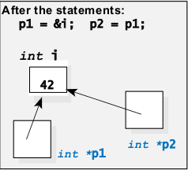
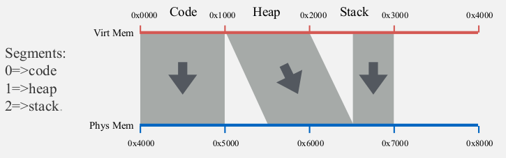

[\<- 01/21](01-21.md)

---

# Pointers and Arrays

### Introduction

- The container classes' capacity is declared as a **constant** in the class definition (`bag::CAPACITY`)
- If we need bigger bags, then we can increase the constant and recompile the code
- What if a program needs one large bag and many small bags?
- All the bags will be of the same size!

### Solution: Dynamic Structures

- Provide control over the size of each bag, independent of the other bags
- This control can come from **dynamic arrays:**
	- Arrays whose size is determined while a program is **actually running (not at compile time)**

## Pointers and Dynamic Memory

### Pointers

- Pointer is the memory address of a variable
- The numbers labeling each byte are called the **memory addresses**
- When a variable occupies several adjacent bytes, the memory address of the first byte is called the memory address of the variable
- The address of a variable is called a **pointer**

**Pointer variable** must be declared by placing an **asterisk** before the pointer variable's name:

```
double *my_first_ptr;
```

- `my_first_ptr` can hold the memory address of a double variable

### Another Example

```
int *example_ptr;
int i;

example_ptr = &i;
```

- **& operator**: Is called the **address operator**, and provides the address of a variable

### Pointer Variables

- In C++ the variable pointed to by `example_ptr` is written `*example_ptr`
- This is the same asterisk notation that we used to declare `*example_ptr`, **but now it has yet another meaning**
- When the asterisk is used in this way, it is called the **dereferencing operator**, and the pointer variable is said to be **dereferenced**

### Pointers and Assignment Operator

```
int i = 42;
int *p1;
int *p2;

p1 = &i;
p2 = &i;

cout << *p1 << endl;
cout << *p2 << endl;
```



### Dynamic Variables and the new Operator

- Real power of pointers arises when pointers are used with special kinds of variables called **dynamically allocated variables**, or more simply, **dynamic variables**
- Dynamic variables are like ordinary variables, with two important differences:
	- **They are not declared**
	- **They are created during the execution of a program**
- To create a dynamic variable while a program is running, C++ programs use an operator called `new` (declared in the global namespace)

### Example

```
double *d_ptr;
d_ptr = new double;
```

- The creation of the new dynamic variables is called **memory allocation** and the memory is **dynamic memory**
- We may say that "`d_ptr` points to a newly allocated double variable from dynamic memory"
- `new` operator creates a new dynamic variable of type double and returns a pointer to this new dynamic variable
- How the memory looks like after these statements?

### Dynamic Behavior

- The array version of `new` is particularly useful because the number of array components can be calculated while the program is running
- If the data type of the **array** component is a **class**, then the **default constructor** is used to initialize all components of the dynamic array

```
fruit *f_ptr;
f_ptr = new fruit[100];
```

- The number of components can depend on factors such as user input
- This is **dynamic behavior** - behavior that is determined when a program is running

### "new" to Allocate Dynamic Arrays

- `new` can allocate an entire array at once, the number of array components is listed in square brackets, immediately after the component data type
- When `new` allocates an entire array, it actually **returns a pointer to the first component of the array**

```
doube *d_ptr;
d_ptr = new double[10];
```

### Address Space

- Divides address space into logical segments
	- Each segment corresponds to logical entity in address space
		- code, stack, heap
- Each segment can be independently:
	- be placed separately in physical memory
	- grow and shrink
	- be protected
		- separate read/write/execute protection bits

### Address Space Segmentation



### Stack Memory

- A special region of memory that stores temporary variables created by each function (including the `main()` function)
	- When a function declares a new variable, it is "pushed" onto the stack
	- When a function exits, all of the variables pushed onto the stack by that function, are freed
	- Once a stack variable is freed, that region of memory becomes available for other stack variables
- Stack variables only exist while the function that created them is running
- Advantage: There is no need to manage memory yourself, variables are allocated and freed automatically

### Heap Memory

- A region that is not managed automatically for you, and is not tightly managed by the CPU
- Once you have allocated memory on the heap, you are responsible for releasing that memory
	- If you fail to do this, your program will have what is known as a **memory leak**
- When you use the `new` operator to allocate memory, this memory is allocated in the program's heap segment
- Scope:
	- Variables created on the heap are accessible by any function, anywhere in your program (unlike stack)
	- **Heap variables are essentially global in scope**

### "delete" Operator

- The size of the heap varies from one computer to another, it could be just a few thousand bytes or more than a billion
- Even with small programs, **it is an efficient practice to release any heap memory that is no longer needed**
- The `delete` operator is used to return the memory of a dynamic variable back to the heap where it can be reused for more dynamic variables
- Example:

```
int *example_ptr;
example_ptr = new_int;
...
delete example_ptr;
```

- `delete` operator can also free a dynamic array of components
- To free an entire array, the array brackets `[]` are placed after the word `delete`

```
int *example_ptr;
example_ptr = new int[50];
...
delete [] example_ptr;
```

### Stack Overflow

**Stack overflow** is the result of:
- Allocating too many variables on the stack
- Making too many nested function calls
	- Example: Where function A calls function B calls function C calls function D...
- Stack overflow generally causes a program to crash

```
int main(){
	int array[100000000];
	return 0;
}
```

- Beyond good programming practices, static and dynamic testing, there's not much you can do

### Heap and "bad_alloc" Exception

- Even the largest heap can be exhausted by allocating too many dynamic variables, when the heap runs out of room, the `new` operator fails
- The `new` operator usually indicates failure by throwing an exception called the `bad_alloc` exception
- Normally, an exception causes an error message to be printed and the program to halt
- Alternatively, a programmer can "catch" an exception and try to fix the problem
	- **Exceptions** provide a way to react to to exceptional circumstances (like runtime errors) in programs
	- When an exception is thrown, control is transferred to its **handler**

### Example 1

```
#include <iostream>
using namespace std;

int main(){
	int input;
	cout << "what is the input? " << '\n';
	cin >> input;

	try{
		if(input < 20) cout << "nice number!" << '\n';
		else throw 20;
	}

	catch(int e){
		cout << "An exception occurred. Exception#: " << e << '\n';
	}

	return 0;
}
```

- `Terminal: what is the input? 20`
	- `An exception occurred. Exception#: 20`

### Example 2

```
#include <iostream> //std::cout
#include <new>      //std::bad_alloc

int main(){

	try{
		int *myarray = new int[1000000];
	}

	catch(std::bad_alloc& ba){
		std::cerr << "bad_alloc caught: " << ba.what() << '\n';
	}

	return 0;
}
```

- If memory allocation is unsuccessful, then the output will be:
	- `bad_alloc caught: bad allocation`

---

### Quiz

Write a program that read a list of numbers and writes it back to screen

1. The number of items is known at the beginning of time

```
void program1(int length){
	int arr[length];
	int i;

	for(i = 0; i < length; i++){
		std::cout << "Enter a number for index " << i << ": ";
		std::cin >> arr[i];
	}

	for(i = 0; i < length; i++){
		std::cout << arr[i];
	}
}
```

2. The number of items is unknown while you develop the program

```
void program2(){
	int *p;
	int length;
	int i;

	cout << "How many? ";
	cin >> length;

	p = new (nothrow)int[length];

	...
```

- `nothrow` is a standard function to prevent a crash if `p` is dereferenced and `length` is 0
