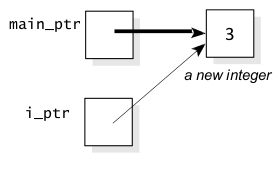

[\<- 01/26](01-26.md)

---

## Pointers and Arrays as Parameters

### Value Parameters that are Pointers

- When a **value parameter is a pointer**, the function **may change the value in the location that the pointer points to**
- The actual argument in the calling program will still point to the same location, but that location will have a new value
- Example:

```
void make_it_3(int *i_ptr){
	//Precondition: i_ptr is pointing to an integer variable
	//Postcondition: The integer that i_ptr is pointer at has been changed to 3
	*i_ptr = 3;
}
```

- Parameter `i_ptr` has type `int*`, that is, a pointer to an integer, **and it is a value parameter**
- The body of the function does not actually change `i_ptr`; it changes only the integer that `i_ptr` points to 
- Example: Assume a program declares a pointer to an integer, allocating memory for the pointer to point to, and calls `make_it_3`:

```
int *main_ptr;
main_ptr = new int; //main_ptr is pointing to a newly allocated integer
make_it_3(main_ptr); //the argument, main_ptr, procides the initial value for the parameter i_ptr
```


- In the body of `make_it_3` function, the assignment statement `*i_ptr = 3` places 3 in the location that `i_ptr` points:



- When a function returns, the formal parameter `i_ptr` is freed because it is a local variable allocated on stack memory
- However, the pointer variable `main_ptr` is still around, and it is still pointing to the same location, but the location has a new value of 3

### Array Parameters

- When a parameter is an array, it is automatically treated as a pointer that points to the first element of the array
- Example:

```
void make_it_all_3(double data[], size_t n){
	//Precondition: data is an array with at least n components
	//Postcondition: The first n elements of the data have been set to 3

	size_t i;
	for(i = 0; i < n; ++i){
		data[i] = 3;
	}
}
```

- If the body of the function changes the components of the array, the changes **do** affect the actual argument
- Example:

```
double main_array[10]; //data allocated on stack memory
make_it_all_3(main_array, 10);
cout << main_array[5]; //prints 3
```

- The actual argument of `make_it_all_3` may be a dynamic array:

```
double *numbers;
numbers = new double[10]; //data allocated on heap memory
make_it_all_3(numbers, 10); //set all elements to 3
```

- You need to remember to delete `numbers` before the end of the above function to avoid a memory leak!

### const Parameters that are Pointers or Arrays

- A parameter that is a pointer may also include the `const` keyword
- Example:

```
bool is_3(const int *i_ptr);
double average(const double data[], size_t n);
```

- `const` keyword indicates that `i_ptr` is a pointer to a constant integer
- Implementation of `is_3` may examine `*i_ptr`, but may not change the value of `*i_ptr`
- `const` keyword indicates that the function cannot change the array entries
- The functions may examine the item that is pointed to (or the array), but changing the item (or array) is forbidden
- Example: Is this valid?

```
bool is_3(const int *i_ptr){
	//Precondition: i_ptr is pointing to an integer variable
	//Postcondition: the return value is true if *i_ptr is 3

	return (*i_ptr == 3);
}
```

- The above is valid because the value of `*i_ptr` is not being changed, only examined

- Example: Is this valid?

```
double average(const double data[], size_t n){
	//Library facilities used: cassert, cstdlib

	size_t i;   //an array index
	double sum; //the sum of data[0] through data[n-1]

	assert(n > 0);

	//add up the n numbers and return the average
	sum = 0;

	for(i = 0; i < n; ++i){
		sum += data[i];
	}

	return (sum/n);
}
```

- The above is valid because the values in the `data` array are not being changed, only examined

### Reference Parameters that are Pointers

- A **reference parameter that is a pointer** is used when a function:
	- Changes a pointer parameter so that the pointer points to a new location
	- The programmer needs the change to affect the actual argument

- Example:

```
void allocate_doubles(double*& p, size_t& n){
	//Postcondition: user has been prompted for a size n, and this size has been read
	//Postcondition: pointer p has been set to point to a new dynamic array containing n doubles
	//NOTE: If there is insufficient dynamic memory, then bad_alloc is thrown

	cout << "How many doubles should I allocate?" << endl;
	cout << "Please enter a positive integer: ";
	cin >> n;
	p = new double[n];
}
```

- `p` is a pointer to a `double` (that is, `double*`) and it is a reference parameter (indicated by the symbol `&`)
- `p = new double[n]`
	- Allocates the array of `n` doubles
	- `p` points to the dynamically allocated memory

- In a program, we can use `allocate_doubles` to allocate an array of double values, with the size of the array determined by interacting with the user
- Example:

```
double *numbers;
size_t array_size;
allocate_doubles(numbers, array_size);
```

```
#include <iostream>

void function_a(int *& a){
	*a += 5;
	int *c;
	a = c;
}

void function_b(int *a){
	*a += 5;
	int *c = new int(7);
	a = c;
}

int main(){
	int *myInt = new int(5);
	int *myInt2 = new int(5);

	function_a(myInt);
	std::cout << myInt << std::endl;
	std::cout << *myInt << std::endl;

	function_b(myInt2);
	std::cout << myInt2 << std::endl;
	std::cout << *myInt2 << std::endl;

	return 0;
}

//OUTPUT:
0x100202210
7
0x100200570
10
```

### Overview of Parameter Types

- Value Parameter:

```
void function(double p);
```

- Reference Parameter:

```
void function(double& p);
```

- const Reference Parameter:

```
void function(const double& p);
```

- Value Parameter that is Pointer:

```
void function(double *p);
```

- const Value Parameter that is Pointer:

```
void function(const double* p);
```

- Reference Parameter that is Pointer:

```
void function(double*& p);
```

---

## The Bag Class with Dynamic Arrays

### The Bag Class with Dynamic Arrays

- Pointers enable us to define data structures whose size is determined when a program is actually **running** rather than at **compilation time**
- Such data structures are called **dynamic data structures**
- This is in contrast to **static data structures**, which have their size determined when a program is **compiled**
- A class may be a dynamic data structure, i.e., it may use dynamic memory

### Pointer Member Variables

- The original bag class has a member variable that is a **static array** containing the bag's item
- Our dynamic bag has a member variable that is a pointer to a **dynamic array**
- The Static Bag:

```
class bag{
	//...
	private:
		value_type data[CAPACITY];
		size_type used;
};
```

- The Dynamic Bag:

```
class bag{
	//...
	private:
		value_type *data;
		size_type used;
		size_type capacity;
};
```

- The constructor for the dynamic bag will allocate a dynamic array
- As a program runs, a new, larger dynamic array can be allocated when we need more capacity

```
class bag{
	public:
		//...
	private:
		value_type *data; //points to a partially filled dynamic array that stores the acutal items of the bag
		size_type used; //stores the number of items in the bag
		size_type capacity; //sores the total size of the dynamic array
};
```

### Member Functions Allocate Dynamic Memory As Needed

- When a class uses dynamic memory, **the class's member functions allocate dynamic memory as needed**
- Example:
	- The constructor of the dynamic bag allocates the dynamic array that the member variable data points to
		- **Question**: How big should this array be?
		- Our plan is to have the constructor allocate a dynamic array whose initial size is determined by a parameter to the constructor
		- Whenever items are inserted into a bag (through the `insert` member function or the `+=` operator) the bag's capacity may be increased

- Why a programmer needs to be concerned about the initial capacity of a bag?
- Can't we just start with a small initial capacity and insert items one after another? The `insert` function will take care of increasing the capacity as needed
	- Yes, this approach works correctly
	- However, if there are many items, then many of the activations of `insert` would need to increase the capacity, and this could be inefficient
	- Each time the capacity is increased, new memory is allocated, the items are copied into the new memory, and the old memory is released
	- **To avoid this repeated allocation of memory**, a programmer can request a large initial capacity

- The new bag's constructor:

```
bag(size_type initial_capacity = DEFAULT_CAPACITY);
//Postcondition: The bag is empty with a capacity given by the parameter
//Postcondition: The insert function will work efficiently (without allocating new memory) until this capacity is reached
```

- Example:
	- When the bag is declared, the programmer can specify a capacity of 1000:
		- `bag kilosack(1000);`
		- 1000 items can be efficiently added to kilosack
	- After the initial capacity is reached, the `insert` function continues to work **correctly**, but it might be **slowed down by memory allocations**

- Notice that the parameter of the constructor has a **default argument**, `DEFAULT_CAPACITY`, which will be a constant in our class definition
- **The single constructor actually serves two purposes:**
	- It **can be used with an argument** to construct a bag with a specific capacity, or
	- It **can be used as a default constructor** (with no argument list)

- Example:

```
bag ordinary; //the initial capacity is DEFAULT_CAPACITY
bag super(9000); //the initial capacity is 9000
```

- Example:

```
bag sixpack(6); //the constructor creates a bag with an initial capacity of 6

sixpack.insert(10);
sixpack.insert(20);
sixpack.insert(30);
```

- After these declarations, the bag's private member variable look like this:


- While the bag is in use, a programmer can make an explicit adjustment to the bag's capacity via a member function called `reserve`:

```
void reserve(size_type new_capacity);
//Postcondition: The bag's current capacity is changed to the new_capacity (but not less than the number of items already in the bag)
//Postcondition: The insert function will work efficiently (without allocating new memory) until the new capacity is reached
```

- By using the `reserve` member function, the bag's efficiency is improved
- The constructor, `reserve`, `insert`, `operator +=`, and `operator +` member functions can allocate new dynamic memory

### Provide Documentation About Possible Dynamic Memory Failure

- There are two extra factors that play an important role whenever a class uses dynamic memory:
	- The first factor is the **value semantics** (i.e., the assignment operator and the copy constructor)
	- The second factor is a requirement for a special member function called a **destructor**

```
class bag{
	public:
		//...
	private:
		value_type *data;
		size_type used;
		size_type capacity;
}
```

- What is the value semantics for this class?

### Value Semantics

- Example: Suppose we set up a bag called `x` with an initial capacity of 5, containing the integers 10, 20, and 30 - then we assign `x` to bag `y` through `y=x`


- What is the problem?

- When we assign `y = x`, we want `y` to have its own dynamic array, completely separate from `x`'s dynamic array


- **We must provide our own assignment operator** rather than relying on the automatic assignment operator
- **We can do this by overloading the assignment operator** for the bag class

```
void bag::operator = (const bag& source);
//Postcondition: The bag that activated this function has the same items and capacity as source
```

- When you overload the assignment operator, **C++ requires it to be a member function**
- In an assignment statement `y=x`, in fact we have `y.operator = (x)` thereby bag `y` is activating the function, and the bag `x` is the argument for the parameter named `source`
- The second part of the value semantics is the **copy constructor**, which is activated **when a new object is initialized as a copy of an existing object**
- Unless you indicate otherwise, `y` is initialized using the automatic copy constructor, which merely copies the member variables from `x` to `y`
- If you want to avoid the simple copying of member variables, then **you must provide a copy constructor with the prototype:**

```
bag::bag(const bag& source);
//Postcondition: The bag that is being constructed has been initialized with the same items and capacity as source
```

- Note: The parameter of the copy constructor is usually a const reference parameter (C++ also permits an ordinary reference parameter, **but does not allow a value parameter**)

### The Destructor

- The **destructor** of a class is **a member function that is automatically acitvated when an object becomes inaccessible**
- **The primary purpose of the destructor is to return an object's dynamic memory to the heap when the object is no longer in use**
- The destructor has three unique features
	1. The name of the destructor is always the tilde character (`~`) followed by the class name
	2. The destructor has no parameters and no return value
		- Example: `~bag();`
	3. Programmers who **use** a class should not need to know about the destructor
		- Programs rarely activate the destructor explicitly
		- The activation is usually **automatic** whenever an object becomes inaccessible

Several common situations cause **automatic destructor activation**:

1. When **a local variable is an object with a destructor**, the destructor is **automatically activated when the function returns**
- Example:
	
```
void example1(){
	bag sample1;
	...
}
```

- When the function `example1` returns, the destructor `sample1.~bag()` is automatically activated

2. Suppose **a function has a value parameter that is an object**

```
void example2(bag sample2);
//Does some calculation using a bag
```

- When the function `example2` returns, the destructor `sample2.~bag()` is automatically activated
- Note: If `sample2` was a reference parameter, then the destructor would no be activated because a reference parameter is actually an object in the calling program, **and that object is still accessible**

3. Suppose that **a dynamic variable is an object**

```
bag *b_ptr;
b_ptr = new bag;
...
delete b_ptr;
```

- When `delete b_ptr` is executed, the destructor for `*b_ptr` is automatically activated
- The destructor ensures that the dynamic array used by `*b_ptr` is released
