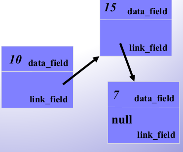

[\<- 01/28](01-28.md)

---

## The Bag Class with Dynamic Arrays (cont.)

### Header File for the Bag Class with a Dynamic Array

```
// FILE: bag2.h (part of the namespace scu_coen79_4)
// CLASS PROVIDED: bag
#ifndef SCU_COEN79_BAG2_H
#define SCU_COEN79_BAG2_H
#include <cstdlib> //provides size_t

namespace scu_coen79_4{

	class bag{

		public:
			//TYPEDEFS and MEMBER CONSTANTS
			typedef int value_type;
			typedef std::size_t size_type;
			static const size_type DEFAULT_CAPACITY = 30;

			//CONSTRUCTOR and DESTRUCTOR
			bag(size_type initial_capacity = DEFAULT CAPACITY);
			bag(const bag& source); //copy constructor
			~bag(); //destructor

			//MODIFICATION MEMBER FUNCTIONS
			void reserve(size_type new_capacity); //increases the bag's current capacity to the new capacity
			bool erase_one(const value_type& target);
			size_type erase(const value_type& target);
			void insert(const value_type& entry); //inserts a new copy of entry to the bag
			void operator +=(const bag& addend);
			void operator =(const bag& source); //enables a bag to have same items and capacity as source

			//CONSTANT MEMBER FUNCTIONS
			size_type size() const {return used;};
			size_type count(const value_type& target) const;

		private:
			//Pointer to partially filled dynamic array
			value_type *data;

			//How much of array is being used
			size_type used;

			//Current capacity of the bag
			size_type capacity;
	};

	//NONMEMBER FUNCTIONS for the bag class
	bag operator +(const bag& b1, const bag& b2);
}

#endif
```

### The Revised Bag Class - Implementation

- Three functions are particularly important:
	1. Constructors
	2. Destructor
	3. Assignment operator
- These three member functions are always needed when a class uses dynamic memory

- **The constructors**: Each of the constructors is responsible for setting up the three private member variables in a way that satisfies the invariant of the dynamic bag class
- **Constructor**:

```
bag::bag(size_type initial_capacity){
	data = new value_type[initial_capacity];
	capacity = initial_capacity;
	used = 0;
}
```

- `initial_capacity` tells how many items to allocate for the dynamic array

- **Copy Constructor**:

```
bag::bag(const bag& source){
	//Library facilities used: algorithm

	data = new value_type[source.capacity];
	capacity = source.capacity;
	used = source.used;
	copy(source.data, source.data + used, data);
}
```

- `copy()` takes in three arguments:
	- The start
	- The end
	- The destination
- The capacity of the dynamic array is the same as the capacity of the bag that is being copied
- After the dynamic array has been allocated, the items may be copied into a newly allocated array

- **The destructor**: The primary responsibility of the destructor is **releasing dynamic memory**

```
bag::~bag(){
	delete [] data;
}
```

**The assignment operator**

- Assignment operator vs. Copy constructor:
	- The assignment operator is not constructing a new bag, meaning that there is already a partially filled array allocated
		- The size of this array might need to be changed
		- If we allocate a new array, then the original array must be returned to the heap
	- In the assignment operator, it is possible that the source parameter (which is being copied) is the same object that activates the operator
		- With a `bag b`, this would occur if a programmer writes `b = b` (called a **self assignment**)

```
void bag::operator =(const bag& source){
	value_type *new_data;

	//If needed, allocate ar array with a different size
	if(capacity != source.capacity){
		new_data = new value_type[source.capacity];
		delete [] data;
		data = new_data;
		capacity = source.capacity;
	}

	used = source.used;
	copy(source.data, source.data + used, data);
}
```

- The solution for the self-assignment is to provide a special check at the start of the operator
- If we find that an assignment such as `b = b` is occurring, then we will return immediately
- We can check for this condition by determining whether source is the same object as the object that activated the operator

```
//Check for possible self-assignment:
if(this == &source) return;
```

- `this` is a **pointer** to the object that activated the function
- `&source` is the **address** of the `source` object
- Revised assignment operator:

```
void bag::operator =(const bag& source){
	value_type *new_data;

	if(this == &source) return; //Check for self-assignment

	//If needed, allocate ar array with a different size
	if(capacity != source.capacity){
		new_data = new value_type[source.capacity];
		delete [] data;
		data = new_data;
		capacity = source.capacity;
	}

	used = source.used;
	copy(source.data, source.data + used, data);
}
```

Example:

- Assume that `source` is a bag with a capacity of 5, and the bag that activated the function has a mere capacity of 2
- When the assignment begins, we have this situation


- Since the current capacity (which is 2) is not equal to the amount needed (which is 5), the code enters the body of the if-statement
- In the body, we have a local variable, `new_data`, which is set to point to a newly allocated array of five items:


- Once the new array has been allocated:
	- We return the old array to the heap
	- Assign `data = new_data`, so that the data pointer points to the new array


- Capacity is changed to 5
- We no longer need the local variable `new_data`


- At this point:
	- Copy the items from source's array into the newly allocated array
	- Set the value of `used`

- Why not to use the following two statements for memory allocation instead of using a local variable?

```
delete [] data; //Release old array
data = new value_type[source.capacity]; //Allocate new array
```

- When the destructor is given an invalid object (such as our invalid bag):
	- The destructor may cause an error message that will be more confusing than the usual message from `bad_alloc`
	- Programs will be harder to debug
- The invalid bag also makes it harder for experienced programmers to deal with the `bad_alloc` exception in a way that tries to recover without halting the program
- Because of these problems: **Member functions must always ensure that all objects are valid prior to calling new**

### The reserve member function

- `reserve` member function is used to change the capacity of a bag

```
void bag::reserve(size_type new_capacity){
	//Postcondition: The bag's current capacity is changed to the new_capacity (but not less than the number of items already in the bag)

	value_type large_array;
	if(new_capacity == capacity) return; //The allocated memory is already the right size
	if(new_capacity < used) new_capacity = used; //can't allocate less than used
	
	larger_array = new value_type[new_capacity];
	copy(data, data + used, larger_array);
	delete [] data;
	data = larger_array;
	capacity = new_capacity;
}
```

### The insert and operator += member functions

```
void bag::insert(const value_type& entry){
	if (used == capacity) reserve(used+1);
	data[used] = entry;
	++used;
}
```

```
void bag::operator +=(const bag& addend){
	//Library facilities used: algorithm

	if(used + addend.used > capacity) reserve(used + addend.used);
	copy(addend.data, addend.data + addend.used, data + used);
	used += addend.used;
}
```

### The operator + member function

```
bag operator +(const bag& b1, const bag& b2){

	bag answer(b1.size() + b2.size()); //The function declares a bag of sufficient size
	answer += b1;
	answer += b2;
	return answer;
}
```

---

## Prescription for a Dynamic Class

### Four Rules

- When a class uses **dynamic memory**, follow these four rules:
	- Some of the member variables of the class are **pointers**
	- Member functions **allocate and release dynamic memory**
	- The **automatic value semantics of the class is overridden**
	- The **class has a destructor** to return all dynamic memory to the heap

### Special Important of the Copy Constructor

- The **copy constructor** is used when **one object is to be initialized as a copy of another**, as in the declaration:

```
bag y(x); //Initialize y as a copy of x
```

- There are three other common situations where the copy constructor is used

1. Alternative syntax: The first situation is really just an alternative syntax for using the copy constructor to initialize **a newly declared object**:

```
bag y = x; //Initialize y as a copy of x
```

2. The second situation that uses the copy constructor is **when a return value of a function is an object**
	- Example: The bag's `operator+` returns a `bag` object
	- The function computes its answer in a local variable, and then has a return statement
	- When the return statement is executed, the value from the local variable is copied to a temporary location called the **return location**
	- The local variable itself is then destroyed (along with any other local variables), and the function returns to the place where it was called

3. A third situation arises **when a value parameter is an object**
	- Example: `int rotations_needed(point p);`
	- When the function is called, **the actual argument is copied to the formal parameter p**
	- The copying occurs **by using the copy constructor**

---

## Smart Pointers

```
class smartIntPtr{
	int *ptr; //Actual pointer

	public:
		//Constructor:
		smartIntPtr(int *p = NULL) {ptr = p;};

		//Destructor
		~smartIntPtr() {delete ptr;};

		//Overloading dereferncing operator
		int& operator *() {return *ptr;};
};

int main(){
	smartIntPtr ptr(new int());
	*ptr = 20;
	cout << *ptr << endl;

	return 0;
}
```

---

## Clarifying the this Keyword

```
class Test{

	public:
		void printAddress() {cout << "My address is: " << this << endl;};
};

int main(){
	Test obj1;
	obj1.printAddress();
	return 0;
}

//Output:
My address is: 0x7fff5fbff6d8
```

```
class Test{

	private:
		int x, y;
	
	public:
		Test(int x = 0; int y = 0) {this->x = x; this->y = y;}
		Test& setX(int a) {x = a; return *this;};
		Test& setY(int b) {y = b; return *this;};
		void print() {cout << "x = " << x << "y = " << y << endl;};
};

int main(){
	Test obj1(5, 5);
	obj1.setX(10).setY(20);

	obj1.print();
	return 0;
}

//Output:
x = 10 y = 20
```

- We return the reference to the calling object
- This allows us to chain the operations
- Another alternative in the main function if `setX()` and `setY()` return `this` instead of `*this`:

```
Test *obj1 = new Test(5, 5);
obj1->setX(10)->setY(20);
```

---

# Data Structures and Other Objects

### Linked Lists in Action

- Chapter 5 introduces the often-used data structure of linked lists
- This presentation shows how to implement the most common operations on linked lists

## Declaration for Linked Lists

- For this presentation, nodes in a linked list are objects as shown here



```
class node{

	public:
		typedef double value_type;
		//...

	private:
		value_type data_field;
		node *link_field;
};
```

- The `data_field` of each node is a type called `value_type`, defined by a typedef
- Each node also contains a `link_field` which is a pointer to another node
- A program can keep track of the front node by using a pointer variable such as `head_ptr`
- Keep in mind that `head_ptr` is not a node -- it is a pointer to a node
- We represent the empty list by storing `null` in the head pointer

## Node Class

```
//Constructor
Node(const value_type init_data = value_type(), node* init_link=NULL) {data_field = init_data; link_field = init_link;};

//Member functions to set the data and link fields
void set_data(const value_type& new_data) {data_field = new_data;};
void set_link(node *new_link) {link_field = new_link;};

//Constant member functions to retrieve the current data
value_type data() const {return data_field};

//Two slightly different member functions to retrieve the current link:
const node *link() const {return link_field;};
node *link() {return link_field;};

private:
	value_type data_field;
	node* link_field;
```

- Whenever a member function returns a `*`, you have to write two functions
	1. const
	2. non const

## Clarifying the const Keyword

- Consider the pointer to a node: `node *p;`
- We can allocate a node for `p` to point to (through using `p = new node`) and then activate any of the member functions (`p->set_data()` or `p->data()`)
- Now consider this pointer parameter declared using `const` keyword: `const node *c;`
- The `const` keyword means that the pointer `c` cannot be used to change the node
	- Pointer `c` cannot be used to activate non-constant member functions
	- The pointer `c` can move and point to many different node, by we are forbidden from using `c` to change any of those nodes that `c` points to

- Note that:
	- We cannot assign a const pointer to a non-const pointer
	- We can assign a non-const pointer to a const pointer

### Example 1

```
node *node_ptr1 = new node;
node *node_ptr2 = new node;

const node const_node_ptr1 = node_ptr1;

const node_ptr1->set_data(5); //Invalid
const_node_ptr1 = node_ptr2;  //Valid
```

- A const pointer cannot be used for activating non-const member functions
- A new value can be assigned to a const pointer

### Example 2: node *const c = &first

```
node *const c = &first;

node *node_ptr1 = new node;
node *node_ptr2 = new node;

const node const_node_ptr1 = node_ptr1;

const node_ptr1->set_data(5); //Valid
const_node_ptr1 = node_ptr2;  //Invalid
```

- If you want to create a **pointer that can be set once during its definition and never changed to point to a new object**, then put the word `const` after the `*`

### Node's Constant Member Functions

- A node's constant member functions should never provide a result that could later be used to change any part of the linked list
- Example: The purpose of the link member function is to obtain a copy of a node's link field
- At first glance, this sounds like a constant member function since retrieving a member variable does not change an object
- So we might write this:

```
node *link() const {return link_field;};
```

### Problem with const

- The node's constant member functions should never provide a result that we can later use to change any part of the linked list

```
node *link() const {return link_field;};
```


```
node *second = head_ptr->link();
```


```
second->set_data(9.2); //!!!!!!!!
```

### Solution 1

- It makes sense to implement link as a non-constant member function:
	- Making the function non-constant **provides better accuracy about how the function's results might be used**
- `link` implementation as a non-constant member function:

```
node *link() {return link_field;};
```

**This solution has another problem**:
	- Suppose that `c` is defined as `const node *c`
	- With the above non-constant link implementation, we could never activate `c->link()`, because it can only activate const functions

### Final Solution

```
const node *link() const {return link_field;};
```

- This **second version** is a constant member function:
	- `c->link()` can be used, even if `c` is declared with the `const` keyword
	- The return value from the `const` version of the function cannot be used to change any part of the linked list
		- The compiler converts the `link_field` to the type `const node*` for the `const` version function

### Rule for const Member Functions

- When the return value of a member function is a pointer to a node, you should generally have two version:
	- A `const` version that returns a `const node *`
	- An ordinary version that return an ordinary pointer to a node
- When both a const and non-const version of a function are present:
	- The **compiler automatically chooses the correct version** depending on whether the function was activated by a constant node (such as `const node *c`) or by an ordinary node
