[\<- 02/02](02-02.md)

---

## Linked List (cont.)

### Dynamic Array to Linked List

```
class bag{
	public:
		//...
	private:
		value_type *data;
		size_type used;
		size_type capacity;
};

//linked list bag
class workout_songs{ //aka bag
	public:
		//...
	private:
		node *head_ptr;
		size_type many_nodes;
};
```

- Value semantics of `workout_songs`
	- assignment and copy constructors will be overwritten

- Invariance of `workout_songs`
	- `head_ptr` always points to the beginning of the list (or null if the list is empty)
	- `many_nodes` always represents the number of nodes in the list

### Constructor

```
bag::bag(){
	head_ptr = NULL;
	many_nodes = 0;
}

//copy constructor
bag::bag(const bag& source){
	Node *tail_ptr;
	list_copy(source.head_ptr, head_ptr, tail_ptr);
	many_nodes = source.many_nodes;
}
```

### Do We need a Destructor?

- Yes!

```
bag::~bag(){
	list_clear(head_ptr);
	many_nodes = 0;
}
```

### Member Functions

```
//MODIFICATION MEMBER FUNCTIONS
size_type erase(const value_type& target);
bool erase_one(const value_type& target);
void insert(const value_type& entry);
void operator +=(const bag& addend);
void operator =(const bag& source);

//CONSTANT MEMBER FUNCTIONS
size_type size() const {return many_nodes;};
size_type count(const value_type& target) const;
value_type grab() const;
```

### Assignment Operator

- **Note**: When the assignment operator begins, the bag already has a linked list, and this linked list must be returned to the heap

```
void bag::operator =(const bag& source){
	node *tail_ptr; //needed for argument to list_copy

	if(this == &source) return; //check for self assignment
	
	list_clear(head_ptr); //to return the existing linked list to the heap
	many_nodes = 0; //we want the bag to be valid before calling list_copy
	list_copy(source.head_ptr, head_ptr, tail_ptr);
	many_nodes = source.many_nodes;
}
```

### Container Class with Linked List

- When a data structure uses a linked list, the assignment operator is important
- Two important aspects:
	- We need to check for "**self-assignment**" such as `b = b`
		- The easiest way to handle self-assignment is to check for it at the start of the assignment operator and simply return with no work if self-assignment is discovered
	- In addition, before calling a function that allocates dynamic memory, **make sure that the invariant of your class is valid**

### erase_one Implementation

- Find the target
- Copy data from `head_ptr` to target
- Remove the head node

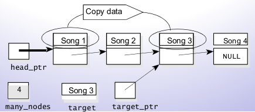

### += Operator

- The implementation starts by making a copy of the linked list of the addend
- The copy is then attached at the front of the linked list for the bag that's being addend to

```
void bag::operator +=(const bag& addend){
	node *copy_head_ptr;
	node *copy_tail_ptr;

	if(addend.many_nodes > 0){
		list_copy(addend.head_ptr, copy_head_ptr, copy_tail_ptr);
		copy_tail_ptr->set_link(head_ptr);
		head_ptr = copy_head_ptr;
		many_nodes += addend.many_nodes;
	}
}
```

### Linked List Toolkit

- These are the utility functions 
	- If you don't have them, you will to implement them over and over

```
//FUNCTIONS for the linked list toolkit
std::size_t list_length(const node *head_ptr);                                 //length of the list
void list_head_insert(node *& head_ptr, const node::value_type& entry);        //insert a new head
void list_insert(node *previous_ptr, const node::value_type& entry);           //insert a new node after the given node
node *list_search(node *head_ptr, const node::value_type& target);             //search for a value in the list
const node* list_search(const node* head_ptr, const node::value_type& target); //search for a node with a certain value in the list
node *list_locate(node *head_ptr, std::size_t position);                       //return the nth node in the list
const node *list_locate(const node *head_ptr, std::size_t position);           //const version of previous function
void list_head_remove(node *& head_ptr);                                       //remove head pointer (head->next becomes the head)
void list_remove(node *previous_ptr);                                          //remove the pointer after the given pointer
void list_clear(node *& head_ptr);                                             //remove all nodes in list
void list_copy(const node *source_ptr, node *& head_ptr, node *& tail_ptr);    //create a copy of a given list
```

### Parameters for Linked Lists

1. Parameters that are pointers with the const keyword
	- Example: The `list_length` function has such a parameter
		`size_t list_length(const node* head_ptr);`
	- The function uses the head pointer to access the list's nodes, but the function does not change any part of the list
	- A pointer to a constant node should be used when the function needs access to the linked list and the function will not make any changes to any of the list's nodes

2. Value Parameters that are pointers to a node
	- The second sort of node pointer parameter is a value parameter without the `const` keyword
	- Example: One of the toolkit's functions will add a new node after a specified node in the list
	- A node pointer should be a value parameter when the function needs access to the linked list, and the function might change the linked list, but the function does not need to make a pointer point to a new node

```
void list_insert(node *p, const node::value_type& entry);
//Precondition: p points to a node in a linked list
//Postcondition: A new node containing the given entry has been added after the node that p points to
```

3. Reference parameters that are pointers to a node
	- Sometimes a function must make a pointer point to a new node
	- Example: Add a new node at the front of a linked list
	- The `head_ptr` is a reference parameter, since the function creates a new head node and makes the head pointer point to this new node
	- When the function needs access to the linked list and the function makes the pointer point to a new node, this change to the pointer will make the actual argument point to a new node

```
void list_head_insert(node *& head_ptr, const node::value_type& entry);
//Precondition: head_ptr is the head pointer of a linked list
//Postcondition: A new node containing the given entry has been added at the head of the list
//Postcondition: head_ptr now points to the head of the new, longer linked list
```

### Inserting a Node at the Front

```
void list_head_insert(node *& head_ptr, const node::value_type& entry);
```

- We want to add a new entry, 13, to the **front** of the linked list shown here:

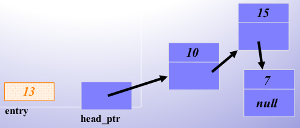

- Create a new node, pointed to by a local variable `insert_ptr`

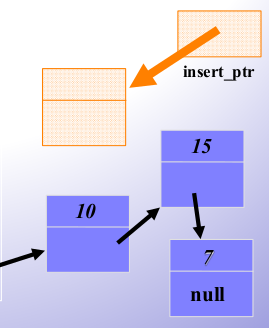

- `insert_ptr = new_node`
	- Place the data in the new node's `data_field`

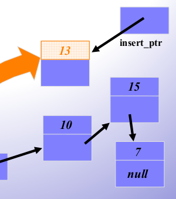

- Connect the new node to the front of the list

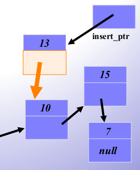

- `insert_ptr = new node(entry, head_ptr);`
	- The correct new node can be completely created in one step by calling an appropriate node constructor

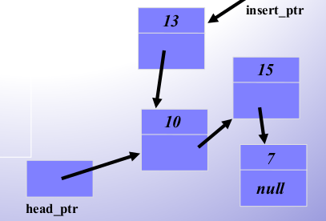

- Make the old head pointer to the new node

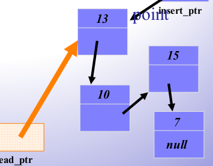

- `head_ptr = insert_ptr`
- When the function returns, the linked list has a new node at the front

```
void list_head_insert(node *& head_ptr, const node::value_type& entry){
	node *insert_ptr;

	insert_ptr = new node(entry, head_ptr);
	head_ptr = insert_ptr;
}
```

- Does the function work correctly for the empty list?
	- Yes

### Caution!

- Always make sure that your linked list functions work correctly with an empty list

### Pseudocode for Inserting Nodes

- Nodes are often inserted at places other than the front of a linked list
- There is a general pseudocode that you can follow for any insertion function...
- Determine whether the new node will be the first node in the linked list. If so, then there is only one step:
	- `list_head_insert(head_ptr, entry);`
- Otherwise, (if the new node will not be first):
	- Start by setting a pointer named `previous_ptr` to point to the node which is just **before** the new node's position

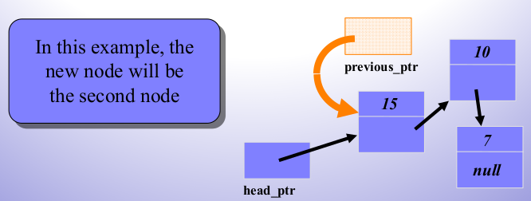

- Look at the pointer which is **in the node** `*previous_ptr`
	- What is the name of this orange pointer?

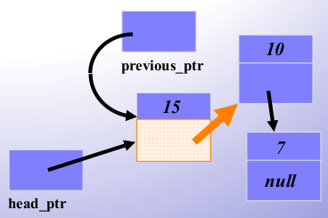

- The pointer is called `previous_ptr->link_field` (although this name may be private to the node)
- `previous_ptr->link_field` points to the head of a small linked list, with 10 and 7

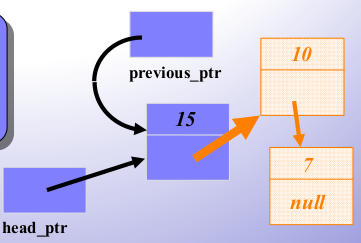

- The new node must be inserted at the front of this small linked list
	- Write one C++ statement which will do the insertion

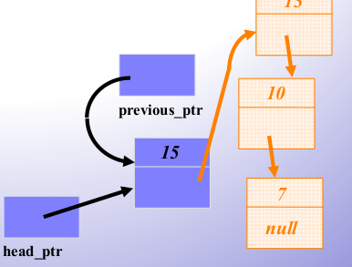

- `list_head_insert(previous_ptr->link_field, entry);`
- What might cause this statement to fail to compile?

- `list_head_insert(previous_ptr->link(), entry);`
	- Use a node member function to get the link field if needed

- Determine whether the new node will be the first node in the linked list. If so, then there is only one step:
	- `list_head_insert(head_ptr, entry);`
- Otherwise (if the new node will not be first):
	- Set a pointer named `previous_ptr` to point to the node which is just before the new node's position
	- Make the function call:
		- `list_head_insert(previous_ptr->link(), entry);`
- The process of adding a new node in the middle of a list can also be incorporated as a separate function. The function is called `list_insert` in the linked list toolkit

### Pseudocode for Removing Nodes

- Nodes often need to be removed from a linked list
- As with insertion, there is a technique for removing a node from the front of a list, and a technique for removing a node from elsewhere
- We'll look at the pseudocode for removing a node from the front of a linked list

### Removing the Head Node

- Start by setting a temporary pointer named `remove_ptr` to the head node

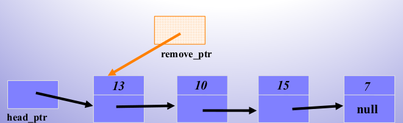

- Set up `remove_ptr`
- `head_ptr = remove_ptr->link();`

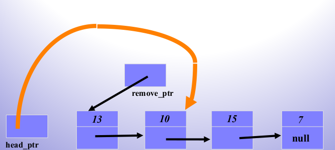

- `delete remove_ptr; //Return the node's memory to heap`

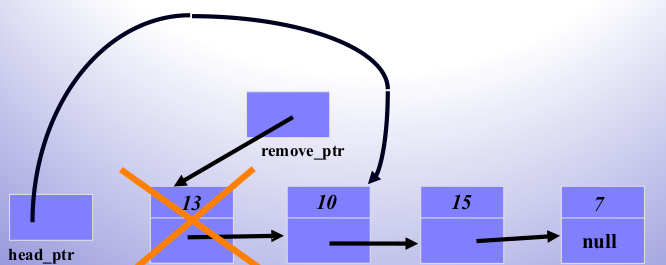

- Here's what the linked list looks like after the removal finishes:

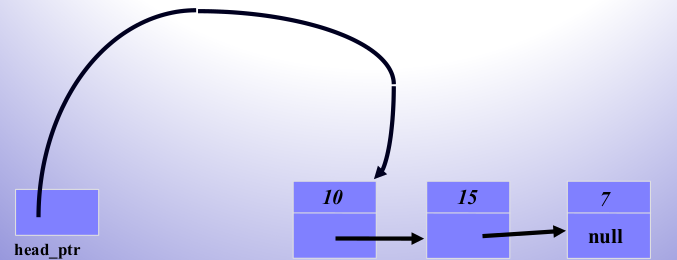

### How to Use Linked-List

- **Node Class + Toolkit**
	- Allow a container class to store elements on a basic linked list with the simplicity and clarity of using an array
- Any programmer can use our node and the toolkit
	- programmers define the `value_type` according to their need
	- Places the `#include "node.h"` in the program

## Summary

- It is easy to insert a node at the front of a list
- The linked list toolkit also provides for inserting a new node elsewhere
- It is easy to remove a node at the front of a list
- The linked list toolkit also provides a function for removing a node elsewhere - you should read about this function and the other functions of the toolkit

---

[02/09 ->](02-09.md)
