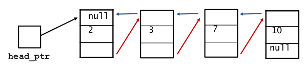

[\<- 02/04](02-04.md)

# Dynamic Arrays vs. Linked Lists vs. Double Linked Lists

- Many classes can be implemented with either dynamic arrays or linked lists
- **Which approach is better?**

## Dynamic Array

### Arrays are better at random access

- The term **random access** refers to examining or changing an arbitrary element that is **specified by its position** in a list
- For example:
	- What is the 2nd item in the list?
	- Change the item at position 16 to 4
- These are **constant time operations** for an array (or dynamic array)
- In a **linked list**, a search for an item must begin at the head and will take **O(N)** time

### Resizing can be inefficient for a dynamic array

- This is because:
	- New memory must be allocated
	- The items are then copied from the old memory to the new memory
	- The old memory is deleted
- When the eventual capacity is unknown and a program must continually adjust the capacity, a linked list has advantages

## Linked Lists

### Linked lists are better at insertions/deletions at a cursor

- If class operations take place at a cursor, then a linked list is better than a dynamic array
- Insertions and deletions at a cursor are generally **linear time (O(N)) for an array** (since items that are after the cursor must be shifted)
- But these operations are **constant time operations (O(1))** for a linked list

## Doubly Linked Lists

### Doubly linked lists are better for a two-way cursor

- Sometimes list operations require a cursor that can move forward and backward through a list
	- A **two-way cursor**
- **Double linked list** is like a simple linked list, except that **each node contains two pointers**: one pointing to the next node and one pointing to the previous node



- A possible definition for a doubly linked list of items:

```
class dnode{
	public:
		typedef ____ value_type;
		...

	private:
		value_type data_field;
		dnode *link_fore;
		dnode *link_back;
};
```

- In C++, this is called the `std::list`
- `link_back` fields points to the previous node
- `link_fore` points to the next node in the list

### A Class for a Node in a Doubly Linked List

```
#ifndef SCU_COEN79_DNODE_H
#define SCU_COEN79_DNODE_H
#include <cstdlib> //provides size_t and NULL
namespace scu_coen79_5{
	class dnode{
		public:
			// TYPEDEF
			typedef double value_type;

			//CONSTRUCTOR
			dnode(const value_type& init_data = value_type(), dnode *init_fore = NULL, dnode *init_back = NULL){
				data_field = init_data;
				link_fore = init_fore;
				link_back = init_back;
			}

			//Member functions to set the data and link fields:
			void set_data(const value_type& new_data) {data_field = new_data;};
			void set_fore(dnoe *new_fore) {link_fore = new_fore;};
			void set_back(dnode *new_back) {link_back = new_back;};

			//Const member function to retrieve the current data:
			value_type data() const {return data_field;};

			//Two slightly different member functions to retrieve each current link:
			const dnode *fore() const {return link_fore;};
			dnode *fore() {return link_fore;};
			const dnode *back() const { return link_back;};
			dnode *back() {return link_back;};

		private:
			value_type data_field;
			dnode *link_fore;
			dnode *link_back;
	};
}

#endif
```

## Guidelines for Choosing Between a Dynamic Array and a Linked List

|Case                                |Data Structure     |
|------------------------------------|-------------------|
|Frequent random access operations   |Use a dynamic array|
|Operations occur at a cursor        |Use a linked list  |
|Operations occur at a two-way cursor|Use a linked list  |
|Frequent resizing may be needed     |Use a linked list  |

## Summary

- A **linked list** consists of node
	- Each **node** contain data and a pointer to the next node in the list
- A linked list is accessed througha **head pointer** that points to the *head node*
- A linked list may have a **tail pointer** that points to the last node
- A **doubly linked list** has nodes with two pointers: one to the next node and one to the previous node
	- Enables a cursor to move forward and backward
- Containers can be implemented in many different ways, such as by using a dynamic array or using a linked list
- Arrays are better at **random access**
- Linked lists are better at **insertions/removals at a cursor**

---

# Template Functions

- Introduction of templates, which are C++ feature that easily permits the reuse of existing code for new purposes
- Shows how to implement and use the simplest kinds of templates: **template functions**

## Finding the Maximum of Two Numbers

### Finding the Maximum of Two Integers

- Here's a small function that you might write to find the maximum of two integers

```
int maximum(int a, int b){
	if(a > b) return a;
	else return b;
}
```

### Finding the Maximum of Two Doubles

- Here's a small function that you might write to find the maximum of two double numbers

```
int maximum(double a, double b){
	if(a > b) return a;
	else return b;
}
```

### Finding the Maximum of Two Knafns

- Here's a small function that you might write to find the maximum of two knafns

```
int maximum(knafn a, knafn b){
	if(a > b) return a;
	else return b;
}
```

### One Hundred Million Functions...

- Suppose your program uses 100,000,000 different data types, and you need maximum function for each...

### A Template Function for Maximum

- This template function can be used with many data types

```
template<typename Item>
Item maximum(Item a, Item b){
	if(a > b) return a;
	else return b;
}
```

- When you write a template function, you choose a data type for the function to depend upon...
- A template prefix is also needed immediately before the function's implementation

### Using a Template Function

- Once a template function is defined, it may be used with any adequate data type in your program...

```
cout << maximum(1, 2);
cout << maxiumum(1.3, 0.9);
```

## Multi Parameter Templates

```
int array_max(int data[], size_t n){
	size_t i;
	int answer;

	assert(n > 0);
	answer = data[0];
	for(i = 1; i < n; i++){
		if(data[i] > answer) answer = data[i];
	return answer;
}
```

### Solution 1

```
template <typename Item>
Item array_max(Item data[], size_t n){
	size_t i;
	Item answer;

	assert(n > 0);
	answer = data[0];
	for(i = 1; i < n; i++){
		if(data[i] > answer) answer = data[i];
	return answer;
}
```

- What are the problems?
	- `size_t` is not generic, so passing, for example, a `const size_t` will return an error

### Examples

```
const size_t SIZE = 5;
double data[SIZE];
//...

cout << array_max(data, SIZE);
cout << array_max(data, 5);

template <typename Item>
Item array_max(Item data[], size_t n);
```

### Solution 2

```
template <typename Item, typename Sizetype>
Item array_max(Item data[], Sizetype n){
	size_t i;
	Item answer;

	assert(n > 0);
	answer = data[0];
	for(i = 1; i < n; i++){
		if(data[i] > answer) answer = data[i];
	return answer;
}
```
