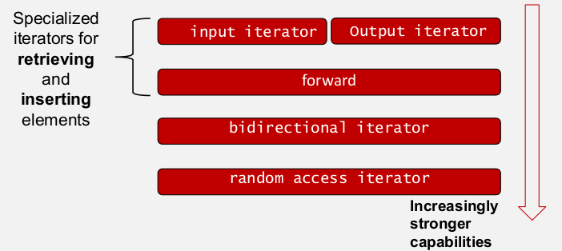
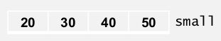

[\<- 02/09](02-09.md)

---

# Template Classes

- A template function is a function that depends on an underlying data type
- In a similar way, when a class depends on an underlying data type, the class can be implemented as a **template class**
- For example, a single program can use a bag of integers, and a bag of characters, and a bag of strings, and...
- You do not have to determine the data type of a data structure when developing a code

## Bag Example

### Syntax For Template Classes

```
class bag{
	public:
		typedef int value_type;
		typedef size_t size_type;
		...
```

```
template <typename Item>
class bag{
	public:
		...
}
```

- `template <typename Item>` is the template prefix, and it warns the compiler that the following definition will use an unspecified data type called `Item`

### Template Class Functions

- The bag's `value_type` is now dependent on the `Item` type
- **Outside the template class definition** some rules are required to tell the compiler about the dependency:
	- The template prefix `template <class Item>` is placed immediately before each function prototype and definition
	- Outside the template class definition, each use of the class name (such as `bag`) is changed to the template class name (such as `bag<Item>`)
	- Within a class definition or within a member function, we can still use the bag's type names, such as `value_type` or `size_type`
	- Outside of a member function, to use a type such as `bag<Item>::size_type`, we must add a new keyword `typename`, writing the expression `typename bag<Item>::size_type`

### Example 1

- For our **original class**, the function's implementation began this way:

```
bag operator +(const bag& b1, const bag& b2) ...
```

- For the **template class**, the start of the implementation is shown here:

```
template <class Item>
bag<Item> operator +(const bag<Item>& b1, const bag<Item>& b2);
...
```

### Example 2

```
bag::size_type bag::count(const value_type& target) const;
```

- Outside of a member function, you must put the keyword `typename` in front of any member of a template class is the name of a data type

```
template <class Item>
typename bag<Item>::size_type bag<Item>::count (const Item& target) const;
```

## Summary: Item and typename

|In the original Bag class          |In the template bag class    |
|-----------------------------------|-----------------------------|
|value_type                         |Item                         |
|size_type (inside member function) |size_type                    |
|size_type (outside member function)|typename bag<Item>::size_type|

## Header File Changes

- **In the header file**, you place the documentation and the prototypes of the functions; **then you must include the actual implementations of all the functions**
	- The reason for the requirement is to make the compiler's job simpler
	- **An alternative**: You can keep the implementations in a separate implementation file, but place an `include` directive at the bottom of the header file to pick up these implementations
	- We include the following line at the end of the header file:

```
#include "bag4.template" //Include the implementation
```

## Do Not Place using Directive

- Because a template class has its implementation included in the header file, we must not place any `using` directives in the implementation
- Otherwiser, every program that uses our template class will inadvertently use the `using` directives

## Bag Class Header and Implementation Files

### Header File for the Bag Template Class

```
#ifndef SCU_COEN79_BAG4_H
#define SCU_COEN79_BAG4_H
#include <cstdlib> //Provides size_t

namespace scu_coen79_6A{
	template <class Item>
	class bag{
		public:
			//TYPEDEFS and MEMBER CONSTANTS
			typedef std::size_t size_type;
			static const size_type DEFAULT_CAPACITY = 30;

			//CONSTRUCTORS and DESTRUCTORS
			bag(size_type initial_capacity = DEFAULT_CAPACITY);
			bag(const bag& source);
			~bag();

			//MODIFICATION MEMBER FUNCTIONS
			size_type erase(const Item& target);
			bool erase_one(const Item& target);
			void insert(const Item& entry);
			void operator =(const bag& source);
			void operator +=(const bag& addend);
			void reserve(size_type capacity);

			//CONSTANT MEMBER FUNCTIONS
			size_type count(const Item& target) const;
			Item grab() const;
			size_type size() const {return used;};

		private:
			Item *data;         //Pointer to partially filled dynamic array
			size_type used;     //How much of array is being used
			size_type capacity; //Current capacity of the bag
	};
```

- Inside the template class definition: Compiler knows about the dependency on `Item` type
- Some rules are required outside of the template class definition:
	- `template<class Item>` is placed immediately before each function prototype and definition
	- Each use of the class name is changed to the template class name (`bag<Item>`)
	- We should then include the implementation of the template in the header file (needed by most compilers)
		- Instead of that: we keep the implementation in a separate file

```
//NONMEMBER FUNCTIONS
//originally: bag operator +(const bag& b1, const bag& b2);

template <class Item>
bag<Item operator +(const bag<Item>& b1, const bag<Item>& b2);

#include "bag4.template"
#endif
```

### Implementation File for the Bag Template Class

```
#include <algorithm> //provides copy
#include <cassert>   //provides assert
#include <cstdlib>   //provides rand

namespace SCU_COEN79_6A{

	//MEMBER CONSTANTS
	template <class Item>
	const typename bag<Item>::size_type bag<Item>::DEFAULT_CAPACITY;
```

- Some compilers require the default parameters to be both in the prototype and implementation
- Remeber that:
	- To refer to `size_type` outside a member function: `typename bag<Item>::size_type`
- Each definition is preceded by `template <class Item>`

```
	//CONSTRUCTORS
	template <class Item>
	bag<Item>::bag(size_type initial_capacity){
		data = new Item[initial_capacity];
		capacity = initial_capacity;
		used = 0;
	}

	template <class Item>
	bag<Item>::bag(const bag<Item>& source){
		//Library facilities used: algorithm

		data = new Item[source.capacity];
		capacity = source.capacity;
		used = source.used;
		std::copy(source.data, source.data + used, data);
	}
```

- Each definition is preceded by `template <class Item>`
- Note: We do not include any `using` directive, as the implementation is in the header file

```
	//DESTRUCTOR
	template <class Item>
	bag<Item>::~bag(){
		delete [] data;
	}

	//MODIFICATION MEMBER FUNCTIONS
	template <class Item>
	typename bag<Item>::size_type bag<Item>::erase(const Item& target){
		size_type index = 0;
		size_type many_removed = 0;

		while(index < used){
			if(data[index] == target){
				--used;
				data[index] = data[used];
				++many_removed;
			}
			else ++index;
		}

		return many_removed;
	}

	//other functions...
}
```

## Parameter Matching for Members

- Unlike an ordinary **template functions**, the compiler is able to match a `size_type` parameter of a **member functions** with any of the usual integer arguments (such as `int` or `const int`)
- Originally:

```
void bag::reserve(size_type new_capacity);
```

- With template:

```
Template <class Item>
void bag<Item>::reserve(size_type new_capacity);
```

## Using Template Bag Class

- When the template bag class is ready, then we can declare one bag of characters and one bag of double numbers:

```
bag<char> letters; //The template parameter is instantiated as a character
bag<double> score; //The template paramter is instantiated as a double
```

---

# The STL's Algorithms and Use of Iterators

## Standard Library

- STL is a vast library of components in C++
- STL is based on *template* programming
- It has three main components
	1. Containers
	2. Algorithms
	3. Iterators
- All components adhere to the principles of data abstractions

## Iterators

- An **iterator** is any object:
	- **Pointing to some element in a range of elements** (such as an array or a container)
	- Has the ability to iterate through the elements of that range using a set of operations (**with at least the increment (++) and dereference (\*) operators**)
- The most obvious form of iterator is a **pointer**
	- A pointer can point to elements in an **array**, and can iterate through them using the increment operator (++)

### Standard Categories of Iterators

- The C++ Standard specifies **fice significant categories of iterators, based on five of their capabilities**



### STL Categories of Iterators

|Iterator form         |Description                                |
|----------------------|-------------------------------------------|
|input iterator        |Read only, forward moving                  |
|output iterator       |Write only, forward moving                 |
|forward iterator      |Both read and write, forward moving        |
|bidirectional iterator|Read and write, forward and backward moving|
|random access iterator|Read and write, random access              |

## Input Iterator

- An input iterator is designed to read a sequence of values
- Current element of an input iterator `p` can be retrieved by using a dereferencing `*` operator such as `x = *p`
- The `++` increment operator moves the iterator forward to another item
- The end of an input iterator's elements is usually detected by comparing the input iterator with another iterator that is known to be just beyond the end of the input range
- Produced by:
	- `istream_iterator`, `find()`

## Output Iterator

- To change the element the iterator refers to, for example: `*p = "dance"`
	- The `++` increment operator moves the iterator forward to another item
	- **The output operator itself cannot be used to retrieve elements**
	- The output iterator's usefulness is limited to the situation where some algorithm needs to put a sequence of elements in a container or other object with an output iterator
- Produced by:
	- `ostream_iterator`, `inserter()`, `front_inserter()`, `back_inserter()`, `move()`

### Input/Output Iterator

```
#include <algorithm>
#include <fstream>
#include <iostream>
#include <iterator>
#include <string>
#include <vector>

//Read a bunch of strings from a file
//sort them lexographically and print them to output stream

using namespace std;

main(){
	//Define a vector to store the strings received from input
	vector<string> strings_v;

	//Define the filestream object used to read data from file
	ifstream fin("input_file.txt");

	//Get input stream and end of stream iterators
	istream_iterator<string> fin_it(fin);
	istream_iterator<string> eos;

	//Get output stream iterators
	ostream_iterator<string> cout_it(cout, " ");

	//Copy elements from input to vector using copy function
	copy(fin_it, eos, back_inserter(strings_v));

	//Sort the vector
	sort(strings_v.begin(), strings_v.end());

	//Copy elements from vector to output
	copy(strings_v.begin(), string_v.end(), cout_it);
}
```

```
Contents of File "input_file.txt": quick brown fox jumps over the lazy dog
Output: brown dog fox jumps lazy over quick the
```

## Forward Iterator

- A forward iterator `p` is an object that provides these items:
	- Have all the functionality of **input iterators**
	- **If they are not constant iterators**, then they also have the functionality of **output iterators**
	- They are limited to one direction in which to iterate through a range (forward)
	- **All standard containers support at least forward iterator types**
- Example: Iterator of a `forward_list` is a forward iterator

### Example

```
#include <iostream>
#include <forward_list>

int main(){
	std::forward_list<int> mylist(4);

	for(std::forward_list<int>::iterator it = mylist.begin(); it != mylist.end(); ++it){
		*it = rand();
	}

	std::cout << "mylist contains:";
	for(std::forward_list<int>::iterator it = mylist.begin(); it != mylist.end(); ++it){
		std::cout << '' << *it;
	}

	return 0;
}
```

## Std::Copy Function

```
template <class InputIt, class OutputIt>
OutputIt copy(InputIt first, InputIt last, OutputIt d_first);
```

- Both InputIt and OutputIt are iterators over the same object
- The first element that is copied comes from first, and the copying continues up to (but not including) last
- The return value is an iterator that is one position beyond the last copied element in the description

### Use of Copy Function

```
int numbers[7] = {0, 10, 20, 30, 40, 50, 60};
int small[4] = {0, 0, 0, 0};

int *p = numbers + 2;     //an iterator that starts at numbers[2]
int *mid = numbers + 6;   //an iterator that starts at numbers[6]

int *small_front = small; //an iterator that starts at small[0]

copy(p, mid, small_front);
copy(numbers+4, numbers+7, small);
```

- After first copy:



- After second copy:


## Bidirectional Iterator

- Has all the abilities of a forward iterator, plus it can move backgward with the `--` operator
- The `--p` operator moves the iterator `p` backward one position and returns the iterator after it has moved backward
- The `p--` operator also moves the iterator backward one position and returns a copy of the iterator before it moved
- Produced by:
	- `list`, `set`, `multiset`, `map`, `multimap`

### Example

```
#include <iterator>  //std::insert_iterator
#include <list>      //std::list
#include <algorithm> //std::copy

int main(){
	std::list<int> foo, bar;
	for(int i = 1; i <= 5; i++){
		foo.push_back(i);
		bar.push_back(i*10);
	}

	std::list<int>::iterator it = foo.begin(); //returns a bidirectional iterator

	std::copy (bar.begin(), bar.end(), it);
	std::cout << "foo:";
	for(std::list<int>::iterator it=foo.begin(); it != foo.end(); ++it){
		std::cout << '' << *it;
	}

	std::cout << '\n';
	return 0;
}
```

```
Output:
foo: 10 20 30 40 50
```

## Random Access Iterator

- Has all the abilities of bidirectional iterators
- The term random access refers to the ability to quickly access any randomly selected location in a container
- A random access iterator `p` can use the notation `p[n]` to provide access to the item that is `n` steps in front of the current item
- Therefore, distant elements can be accessed directly by applying an offset value to an iterator without iterating through all the elements in between
- Produced by: ordinary pointers, `vector`, `deque`
- Example: `p[0]` is the current item, `p[1]` is the next item, and so on

## Array Iterator

- C++ allows any pointer to an element in an array to be used as if it were a random access iterator
- The "current item" of such a pointer is the array element it points to
- The `++` and `--` operators move the pointer forward or backward one spot
- For a pointer `p`, the notation `p[i]` refers to the item that is `i` steps ahead of the current item
- Since a pointer to an array is a random access iterator, we can use these pointers in Standard Library functions that expect an iterator

## Iterator Invalidation Rules

- **Insert an element**
	- vector: all iterators and references before the point of insertion are unaffected, unless the new container size is greater than the previous capacity (in which case all iterators and references are invalidated)
	- list: all iterators and references unaffected
- **Erase an element**
	- vector: every iterator and reference after the point of erase is invalidated
	- list: only the iterators and references to the erased element is invalidated
