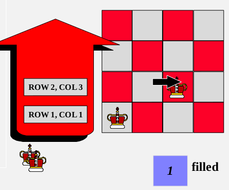

[\<- 02/11](02-11.md)

---

# STL Vectors vs. STL Lists

## Containers

- STL includes three similar container classes
	- **Vectors**: uses a dynamic array
	- **Lists**: uses a doubly linked list
	- **Deques**: uses a third mechanism that we will see in the future

## Vectors

```
template <class T, class Alloc = allocator<T>>
class vector;
```

- `T`:
	- Type of the elements
	- Aliased as member type `vector::value_type`
- `Alloc`:
	- Type of the allocator object used to define the storage model
	- Allocators:
		- Are an important component of the C++ Standard Library
		- A common trait among STL containers is their ability to change size during the execution of the program
		- To achieve this, some form of dynamic memory allocation is usually required
		- Allocators handle all the requests for allocation and deallocation of memory for a given container

### Vectors vs. Arrays

- **Similar to arrays:**
	- vectors use contiguous storage locations for their elements
	- Elements can also be accessed using offsets on regular pointers to its elements, and just as efficiently as in arrays
- **Unlike arrays:**
	- vector size can change dynamically
	- vectors use a dynamically allocated array to store their elements
		- vectors do not reallocate each time an element is added to the container
		- vector containers may allocate some extra storage to accommodate for possible growth
	- vectors provide efficient element access (just like arrays) and relatively efficient adding or removing elements from its end

### Vector Iterator

```
std::vector::begin
iterator begin();
const_iterator begin() const;
```

- Returns an integer pointing to the first element in the vector
- If the container is empty, the returned iterator value should not be dereferenced

```
std::vector::end;
iterator end();
const_iterator end() const;
```

- Returns an iterator referring to the past-the-end element in the vector container

### Vector::push_back

```
void push_back(const value_type& val);
```

- Adds a new element **at the end of the vector**
- This effectively increases the container size by one, which causes an **automatic reallocation** of the allocated storage space **if - and only if - the new vector size surpasses the current vector capacity**


### Example 1

```
#include <iostream>
#include <vector>

int main(){
	std::vector<int> myvector;
	for(int i=1; i <= 5; i++) myvector.push_back(i);

	std::cout << "myvector contains:";
	for(std::vector<int>::iterator it = myvector.begin(); it != myvector.end(); ++it){
		std::cout << ' ' << *it;
	}

	std::cout << '\n';
	return 0;
}
```

### Quiz

- Write a function that asks for a group of numbers and outputs the numbers
	- In original order
	- In reverse order

### Reverse Algorithm Example

```
#include <iostream>  //std::cout
#include <algorithm> //std::reverse
#include <vector>    //std::vector

int main(){
	std::vector<int> myvector

	//set some values
	for(int i = 1; i < 10; ++i) myvector.push_back(i); //1, 2, 3, 4, 5, 6, 7, 8, 9
	std::reverse(myvector.begin(), myvector.end()); //9, 8, 7, 6, 5, 4, 3, 2, 1

	//print out content
	std::cout << "myvector contains:";
	for(std::vector<int>::iterator it=myvector.begin(); it != myvector.end(); ++it){
		std::cout << ' ' << *it;
	}

	std::cout << '\n';
	return 0;
}
```

```
template <class BidirectionalIterator>
void reverse(BidirectionalIterator first, BidirectionalIterator last){
	while((first != last) && (first != --last)){
		std::iter_swap(first, last);
		++first;
	}
}
```

### Example 2

```
void pop_back();
```

- **Removes the last element in the vector**, effectively reducing the container size by one

```
#include <iostream>
#include <vector>

int main(){
	std::vector<int> myvector;
	int sum(0);
	myvector.push_back(100);
	myvector.push_back(200);
	myvector.push_back(300);

	while(!myvector.empty()){
		sum += myvector.back();
		myvector.pop_back();
	}

	std::cout << "The elements of myvector add up to " << sum << '\n';
	return 0;
}

//Output
The elements of myvector add up to 600
```

---

# Using a Stack

- Chapter 7 introduces the **stack** data type
- Several example applications of stacks are given in that chapter
- Another use: **backtracking to solve the N-Queens problem**

## The N-Queens Problem

- Suppose you have 8 chess queens and a chess board
- Can the queens be placed on the board so that no two queens are attacking each other?

### How the program works

- The program uses a stack to keep track of where each queen is placed
- Each time the program decides to place a queen on the board, the position of the new queen is stored in a record which is placed in the stack
- We also have an integer variable to keep track of how many rows have been filed so far


- Each time we try to place a new queen in the next row, we start by placing the queen in the first column...
- If there is a conflict with another queen, then we shift the new queen to the next column
- If another conflict occurs, the queen is shifted rightward again



- When there are no conflicts, we stop and add one to the value of filled

- Let's look at the third row. The first position we try has a conflict...
	- so we shift to column 2. But another conflict arises...
	- and we shift to the third column. Yet another conflict arises
	- and we shift to column 4. There's still a conflict, so we try to shift rightward again
		- But there's nowhere else to go
- When we run out of room in a row:
	- pop the stack, reduce `filled` by 1 and continue working on the previous row
	- Now we continue working on row 2, shifting the queen to the right
	- This position has no conflicts, so we can increase `filled` by 1, and move to row 3


- In row 3, we start again at the first column

### Pseudocode for N-Queens

- Initialize a stack where we can keep track of our decisions
- Place the first queen, pushing its position onto the stack and setting `filled` to 0
- repeat these steps
	- if there are no conflicts with the queens...
		- Increase filled by 1. If filled is now N, then the algorithm is done. Otherwise, move to the next row and place a queen in the first column
	- else if there is a conflict and there is room to shift the current queen rightward...
		- Move the current queen rightward, adjusting the record on top of the stack to indicate the new position
	- else if there is a conflict and there is no room to shift the current queen rightward...
		- Backtrack~ Keep popping the stack, and reducing filled by 1, until you reach a row where the queen can be shifted rightward. Shift this queen right

## Stack Description

- Entries in a stack are ordered: There is one that can be accessed first (the one on top), one that can be accessed second (just below the top), ...
- **We do not require that the entries can be compared using the `<` operator**
- Stack entries must be removed in the reverse order
	- Because of this property a stack is called a **Last-In/First-Out** data structure (LIFO)
- Adding an entry to stack is called a **push** operation, and removing an entry from a stack is called a **pop** operation

## Array Implementation of the Stack

- Our stack template class definition uses two private member variables:
	- A partially-filled array, called `data`, that can hold up to `CAPACITY` items
	- A single member variable, `used`, that indicates how much partially-filled array is currently being used
		- `data[0]` is at "the bottom" of the stack
		- `data[used-1]` is at "the top" of the stack
		- If the value of used is zero, this will indicate an empty stack
- **Invariant of the `stack` Class** (Array Version)
	- The number of items in the stack is stored in the member variable `used`
	- The items in the stack are stored in a partially filled array called `data`, with the bottom of the stack at `data[0]`, the next entry at `data[1]`, and so on to the top of the stack at `data[used-1]`

### Array Implementation

```
#ifndef SCU_COEN79_STACK1_H
#define SCU_COEN79_STACK1_H
#include <cstdlib> //Provides size_t

namespace scu_coen79_7A{
	template <class Item>
	class stack{
		public:
			typedef std::size_t size_type;
			typedef Item value_type;
			static const size_type CAPACITY = 30;

			//CONSTRUCTOR
			stack() {used = 0;};

			//MODIFICATION MEMBER FUNCTIONS
			void push(const Item& entry);
			void pop();

			//CONSTANT MEMBER FUNCTIONS
			bool empty() const {return (used == 0);};
			size_type size() const {return used};
			Item top() const;

		private:
			Item data[CAPACITY];
			size_type used;
	};
}
```

## Stack as Dynamic Structure

- Size can grow and shrink during execution
- **The head of the linked list serves as the top of the stack**
- Invariant of the Stack Class (Linked-List Version):
	- The items in the stack are stored in a linked list, with the top of the stack stored at the head node, down to the bottom of the stack at the tail node
	- The member variable `top_ptr` is the head pointer of the linked list of items

## The Standard Library Stack Class

- The C++ Standard Template Library (STL) has a stack class
- Stack is specified as a template class
- The most important member functions are:
	- `push`: to add an entry to the top of the stack
	- `pop`: to remove the top entry
	- `top`: to get the item at the top of the stack without removing it
- There are no functions that allow a program to access entries other than the top entry
- **Stack underflow**: If a program attempts to pop an item off an empty stack
	- To help you avoid a stack underflow, the class provides a member function to test whether a stack is empty
- **Stack overflow**: If a program attempts to push an item onto a full stack

```
template <class T, class Container = deque<T>> class stack;
```

- **stacks** are implemented as *container adaptors*
- **Container adaptors** are classes that use an encapsulated object of a specific container class as its *underlying container*, providing a specific set of member functions to access its elements
- The container shall support the following operations:
	- `empty`
	- `size`
	- `top` (or `back`)
	- `push_back`
	- `pop_back`
- The standard container classes **vector**, **deque**, and **list** fulfill these requirements

```
#include <iostream> //std::cout
#include <stack>    //std::stack

int main(){
	std::stack<int> mystack;
	mystack.push(1);
	mystack.push(2);
	mystack.top() += 10;
	std::cout << "mystack.top() is now " << mystack.top() << '\n';
	return 0;
}

//Output
mystack.top() is now 12
```

### STL Stack Implementation

```
template<class T, class C = deque<T>>
class std::stack{
	protected: C c;
	public:
		typedef typename C::value_type value_type;
		typedef typename C::size_type size_type;
		typedef C container_type;
		explicit stack(const C& a = C()) : c(a){} //Inherit the constructor
		bool empty() const {return c.empty();};
		size_type size() const {return c.size();};
		value_type& top() const {return c.back();};
		const value_type& top() const {return c.back();};
		void push(const value_type& n) {c.push_back(n);};
		void pop() {c.pop_back();};
};
```

## Summary

- A stack is a Last-In/First-Out (**LIFO**) data structure
- The accessible end of the stack is called the **top**
- Adding an entry to a stack is called a **push** operation
- Removing an entry from a stack is called a **pop** operation
- Attempting to push an entry onto a full stack is an error known as a **stack overflow**
- Attempting to pop an entry off an empty stack is an error known as a **stack underflow**
- A stack can be implemented as a **partially filled array** or a **linked list**
- Stacks have many uses in computer science
	- The **evaluation and translation of arithmetic expressions** are two common uses
