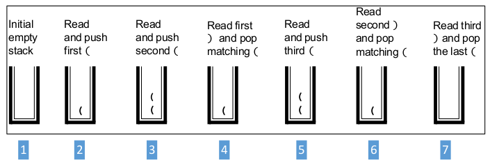

[\<- 02/16](02-16.md)

---

# Stack Applications

- Most compilers use stacks to analyze the syntax of a program
- Stacks are used to keep track of local variables when a program is run
- Stacks can be used to search a maze or a family tree or other types of branching structures

## Programming Example: Balanced Parenthesis

- Assume function `is_balanced()` checks expressions to see if the parentheses match correctly
- Example 1: Consider the string `"((X + Y*(Z + 7)) * (A + B))"`
	- Each of the left parentheses has a corresponding right parenthesis
	- As the string is read from left to right, there is never an occurrence of a right parenthesis that cannot be matched with a corresponding left parenthesis
	- Function call `is_balanced ("((X + Y*(Z + 7)) * (A + B))")` returns true
- Example 2: `is_balanced("((X + Y*(Z + 7) * (A + B))")` returns false

- Scans the characters of the string from left to right
- Every time the function sees a **left parenthesis**, it is **pushed** onto the stack
- Every time the program reads a **right parenthesis**, the program **pops** a matching left parenthesis off the stack
	- **Parentheses match**: If the stack is empty at the end of the expression
	- **Parentheses do not match**:
		- If the stack is empty when the algorithm needs to pop a symbol, or
		- If symbols are still in the stack after all the input has been read

```
//FILE: parens.cxx
//A small demonstration program for a stack
#include <cstdlib>  //Provides EXIT_SUCCESS
#include <iostream> //Provides cin, cout
#include <stack>    //Provides stack
#include <string>   //Provides string

using namespace std;

//PROTOTYPE for a function used by this demonstration program
bool is_balanced(const string& expression);
//Postcondition: A true return value indicates that the parentheses in the given expression are balanced. Otherwise, the return value is false
//Library facilities used: stack, string (and using namespace std)

bool is_balanced(const string& expression){
	const char LEFT_PARENTHESIS = '(';
	const char RIGHT_PARENTHESIS = ')';

	stack<char> store;   //Stack to store the left parentheses as they occur
	string::size_type i; //An index into the string
	char next;           //The next character from the string
	bool failed = false; //Becomes true if a needed parenthesis is not found

	for(i = 0; !failed && (i < expression.length()); ++i){
		next = expression[i];
		if(next == LEFT_PARENTHESIS) store.push(next);
		else if((next == RIGHT_PARENTHESIS) && (!store.empty())) store.pop(); //Pops the corresponding left parenthesis
		else if((next == RIGHT_PARENTHESIS) && (store.empty())) failed = true;
	}

	return (store.empty() && !failed);
}

int main(){
	string user_input;

	cout << "Type a string with some parentheses:\n";
	getline(cin, user_input);

	if(is_balaned(user_input)) cout << "Those parentheses are balanced.\n";
	else cout << "Those parentheses are not balanced.\n";

	cout << "That ends this balancing act.\n";

	return EXIT_SUCCESS;
}
```

- Example: Input `" (()())"`



## Programming Example: Evaluating Arithmetic Expressions

- We will design and write a **calculator program**
- Uses two stacks: **a stack of characters**, and **a stack of double numbers**
- **Specification**:
	- The program takes as input **a fully parenthesized** expression:
		- `((((12 + 9)/3) + 7.2) * ((6 - 4)/8))`
	- The expression consists of integers or double numbers, together with the operators `+`, `-`, `*`, and `/`, to focus on the use of the stack (rather than on input details)
	- We assume that:
		- The expression is formed correctly so that each operation has two arguments
		- The expression is fully parenthesized
		- Each input number is non-negative
	- The output will simply be the value of the arithmetic expression

- **Design**: Most of the program's work will be carried out by a function that reads one line of input and evaluates that line as an arithmetic expression
- Example: Consider expression `(((6 + 9)/3) * (6 - 4))`
	1. Evaluate the innermost expressions to produce the similar expression `((15/3) * 2)`
	2. Evaluate the expression `(15/3)` and replace this expression with its value of `5` to produce expression `(5 * 2)`
	3. Evaluate the last expression to obtain the final answer of `10`
- **We need a specific way to find the expression to be evaluated next and a way to remember the results of our intermediate calculations**

- How to choose the next expression to be evaluated?
- We know that the expression to be evaluated first must be one of the innermost expressions
- Example: In `(((6 + 9)/3) * (6 - 4))` the innermost expressions are `(6+9)` and `(6-4)`, and the leftmost one of these is `(6+9)`
	- If we evaluate the leftmost of the innermost expressions, we obtain `((15/3) * (6 - 4))`, now we go back and evaluate the other innermost expression `(6-4)`
- There is a simpler approach that spares us the trouble of remembering any other expressions
	- After we evaluate the leftmost of the innermost expressions, we are left with another simpler arithmetic expressions, namely `((15/3) * (6 - 4))`, so we can simply repeat the process with this simpler expression: We again evaluate the leftmost of the innermost expressions of our new simpler expression

- **Design**: The entire process will look like:
	1. Evaluate the leftmost of the innermost expressions in `(((6 + 9)/3) * (6 - 4))` to produce the simpler expression `((15/3) * (6 - 4))`
	2. Evaluate the leftmost of the innermost expressions in `((15/3) * (6 - 4))` to produce the simpler expression `(5 * (6 - 4))`
	3. Evaluate the leftmost of the innermost expressions to produce `(5 * 2)`
	4. Evaluate the leftmost of the innermost expressions to obtain the final answer `10`

- **Question**: How to find the leftmost of the innermost expressions?
- According to the expression `(((6 + 9)/3) * (6-4))`, **the end of the expression to be evaluated is always a right parenthesis, `')'`, and moreover, it is always the first right parenthesis**
- After evaluating one of these innermost expressions, there is no need to back up; to find the next right parenthesis we can just keep reading left to right from where we left off
- The next right parenthesis will indicate the end of the next expression to be evaluated

- **Question**: How do we keep track of our intermediate values?
- **We use two stacks**
	- A stack contains numbers from the input as well as numbers that were computed when the subexpressions were evaluated
	- The other stack will hold symbols for the operations that still need to be evaluated
- Because a stack processes data in a LIFO manner, it will turn out that the correct two numbers are on the top of the numbers stack at the same time that the appropriate operation is at the top of the stack of operations

# More Complex Stack Applications

## Evaluating Postfix Expressions

- We normally write an arithmetic operation between its two arguments
- Example: The `+` operation occurs between the `2` and the `3` in the arithmetic expression `2+3`
	- This is called **infix notation**
- There is another way of writing arithmetic operations that **places the operation in front of the two arguments**
	- This is called **Polish prefix notation** or simply **prefix notation**
- Using prefix notation, parentheses are completely avoided
- Example: The expression `(2 + 3) * 7`, when written in this **Polish prefix notation**: `* + 2 3 7`
- The curved lines under the expression indicate groupings of subexpressions

- We can write the operations after the two numbers being combined
	- Called **Polish postfix notation**, or more simply **postfix notation** (or sometimes **reverse Polish notation**)
- Example: The expression `(2 + 3) * 7` when written in **Polish postfix notation** is: `2 3 + 7 *`
- Longer example: The **postfix expression** `7 3 5 * + 4 -` is equivalent to the infix expression `(7 + (3*5)) - 4`
- **Postfix notation** is handy because it does not require parentheses and because it is particularly easy to evaluate
	- This notation often is used because of the ease of expression evaluation

- There are two input format issues that we must handle:
	- When entering postfix notation we will require a space between two consecutive numbers
		- Example: The input `35 6` consists of two numbers, `35` and `6`, with a space in between
	- For now, restrict the input to non-negative numbers in order to avoid the complication of distinguishing the negative sign of a number from a binary subtraction operation
- Using postfix notations: Each operation is used as soon as it is read
	- Our algorithm for evaluating a postfix expression uses only one stack, which is a stack of numbers
	- There is no need for a second stack of operation symbols

**Pseudocode**

- Initialize a stack of double numbers

```
do
	if(the next input is a number)
		Read the next input and push it onto the stack
	
	else
		- Read the next character, which is an operation symbol
		- Use top and pop to get the two numbers off the stack
		- Combine these two numbers with the operation (using the second number popped as the left operand), and push the result onto the stack

while(there is more of the expression to read)
```

- At this point, the stack contains one number, which is the value of the expression

## Translating Infix to Postfix Notation

- One strategy for evaluating an ordinary infix expression is to first convert it to postfix notation and then evaluate the postfix expression
	- This is what compilers often do
- **If the infix expression is fully parenthesized, the algorithm is simple**:
	- Move each operation symbol to the location of the right parenthesis corresponding to that operation and then remove all parentheses
- The problem is finding the location for inserting the operation in the postfix expression?
	- How do we save the operations?
	- How do we know when to insert them?

- If we push the operations onto a stack, then the operation we need will always be on top of the stack
- The heart of the algorithm is to push the operations onto a stack and to pop an operation every time we encounter a right parenthesis

**Pseudocode**

- Initialize a stack of characters to hold the operations symbols and parentheses

```
do
	if(the next input is a left parenthesis)
		Read the left parenthesis and push it onto the stack
	
	else if(the next input is a number or other operand)
		Read the operand and write it to the output

	else if(the next input is one of the operation symbols)
		Read the operation symbol and push it onto the stack

	else
		- Read and discard the next input symbol (which should be a right parenthesis)
		- There should be an operation symbol on top of the stack, so write this symbol to the output and pop it from the stack
		- After popping the operation symbol, there should be a left parenthesis on the top of the stack, so pop and discard this left parenthesis

while(there is more of the expression to read);
```

- At this point, the stack should be empty; otherwise print an error message indicating that the expression was not fully parenthesized
