[\<- 02/18](02-18.md)

# Using a Queue

- Introduction of the **queue** data type
- Several example applications of queues are given
- This presentation describes the queue operations and two ways to implement a queue

## The Queue Operations

- A queue is like a line of people waiting for a bank teller. The queue has a **front** and a **rear**
- The people must enter the queue at the rear. The C++ queue class calls this a **push**, although it is usually called an **enqueue** operation
- When an item is taken from the queue, it always comes from the front. The C++ queue calls this a **pop**, although it is usually called a **dequeue** operation

## The Queue Class

- The C++ standard template library has a queue template class
- The template parameter is the type of the items that can be put in the queue

```
template <class Item>
class queue<Item>{
	public:
		queue();
		void push(const Item& entry);
		void pop();
		bool empty() const;
		Item front() const;
		...
```

## Array Implementation

- A queue can be implemented with an array, as shown here. For example, this queue contains the integers 4 (at the front), 8 and 6 (at the rear)

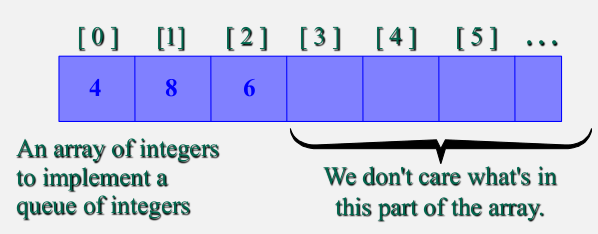

- The easiest implementation also keeps track of the number of items in the queue and the index of the first element (at the front of the queue) and the last element (at the rear)

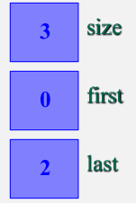

### Dequeue and Enqueue Operation

- When an element leaves the queue, size is decremented and first changes, too
- When an element enters the queue, size is incremented, and last changes, too
	- Example: After one pop and one push

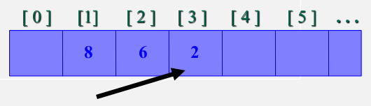
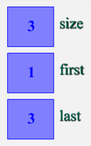

### At the End of the Array

- There is special behavior at the end of the array. For example, suppose we want to add a new element to this queue, where the last index is `[5]`
- The new element goes at the fron of the array (if that spot isn't already used)

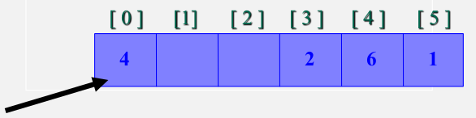
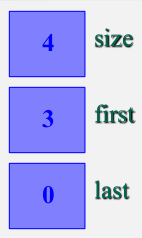

### Circular View of the Array

- view the array as bent into a circle, with the final array element attached back to the beginning

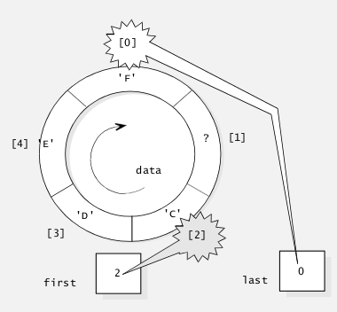

**Implementation**:

- `data`: A private member variable that holds the queue's entries in an array
- The private member variables `first` and `last` hold the indexes for the front and rear of the queue
	- Whenever the queue is non-empty, the entries begin at the location `data[first]`
	- If the entries reach the end of the array, then they continue at the first location, `data[0]`
	- In any case, `data[last]` is the last entry in the queue
- `count`: A private member variable that records the number of items that are in the queue
	- `count` will be used to check whether the queue is empty or full

### Helper Function

- Use helper function called `next_index` to easily step through the array
- This is a private member function

```
next_index = (i+1) % CAPACITY
```

### Queue Header File (Array Version)

```
#ifndef SCU_COEN79_QUEUE1_H
#define SCU_COEN79_QUEUE1_H

#include <cstdlib> //Provides size_t

namespace scu_coen79_8B{
	template <class Item>
	class queue{
		public:
			typedef std::size_t size_type;
			typedef Item value_type;
			static const size_type CAPACITY = 30;

			//CONSTRUCTOR
			queue();

			//MODIFICATION MEMBER FUNCTIONS
			void pop();
			void push(const Item& entry);

			//CONSTANT MEMBER FUNCTIONS
			bool empty() const {return (count == 0);};
			Item front() const;
			size_type size() const {return count;};

		private:
			Item data[CAPACITY]; //Circular array
			size_type first;     //Index of item at front of the queue
			size_type last;      //Index of item at rear of the queue
			size_type count;     //Total number of items in the queue

			//HELPER MEMBER FUNCTION
			size_type next_index(size_type i) const {return (i+1)%CAPACITY;};
	};
}

#include "queue1.template"
#endif
```

- When a class requires some small operation that is implemented as a formula, consider implementing the formula with a **helper function**

### Queue Class Implementation

```
//TEMPLATE CLASS IMPLEMENTED: queue<Item>
//INVARIANT for the queue class:
	//1. The number of items in the queue is in the member variable count
	//2. For a non-empty queue, the items are stored in a circular array beginning at data[first] and continuing though data[last]. The array's total capacity is CAPACITY
	//3. For an empty array, last is some valid index, and first is always equal to next_index(last)

#include <cassert>
namespace scu_coen79_8B{
	template <class Item>
	const typename queue<Item>::size_type queue<Item>::CAPACITY;

	template <class Item>
	queue<Item>::queue(){
		count = 0;
		first = 0;
		last = CAPACITY - 1;
	}
```

- Satisfies the invariant: For an empty queue, `last` is some valid index, and `first = next_index(last)`

### Empty Queue

```
int main(){
	queue<char> q;
	...
}
```

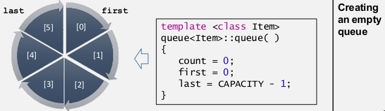

### Add An Item

```
int main(){
	queue<char> q;
	q.push('A');
	...
```

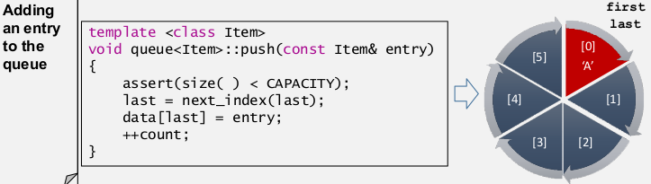

### Remove An Item

```
int main(){
	queue<char> q;
	q.push('A');
	q.pop();
	...
}
```


### Empty/Full Queue

- An empty queue
	- `first = next_index(last)`
	- `count = 0`

- A full queue
	- `first = next_index(last)`
	- `count = 6`

### Array Implementation

- Easy to implement
- But it has a limited capacity with a fixed array
- Or you must use a dynamic array for an unbounded capacity
- Special behavior is needed when the rear reaches the end of the array

## Linked List Implementation

- A queue can also be implemented with a linked list with both a head and a tail pointer
- The `head_ptr` points to the front of the list
	- Because it is harder to remove items from the tail of the list

### Invariant of Queue Class (Linked-List)

- The number of items in the queue is stored in the member variable `count`
- The items in the queue are stored in a linked list, with the front of the queue stored at the head node, and the rear of the queue stored at the final node
- Pointers:
	- `front_ptr` is the head pointer
	- For a non-empty queue, the member variable `rear_ptr` is the tail pointer of the linked list
	- for an empty list, we don't care what's stored in `rear_ptr` (as `front_ptr` is `NULL`)

### Push Member Function

```
list_insert(rear_ptr, entry);
rear_ptr = rear_ptr->link();
```

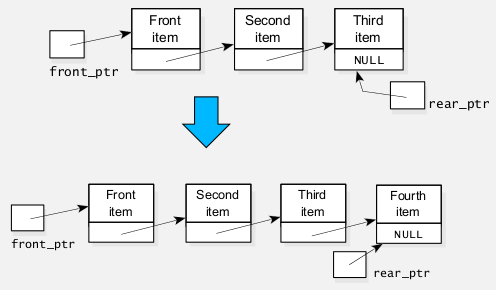

### Adding An Item

```
if(empty()){
	//Insert first entry
	scu_coen79_6B::list_head_insert(front_ptr, entry);
	rear_ptr = front_ptr;
}
else {
	//Insert an entry that is not the first
	scu_coen79_6B::list_insert(rear_ptr, entry);
	rear_ptr = rear_ptr->link();
}

++count;
```

### Pop Member Function

```
//The implementation uses list_head_remove
assert(!empty());
list_head_remove(front_ptr);
--count;
```

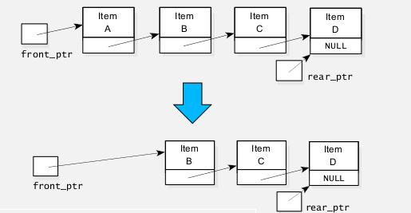

### Iterator Validation

- What are the iterator invalidation rules for the linked-list version of the queue class?

---

# STL deque Class

- A variation of queue is a **double-ended queue**, also called a **deque**
- Entries can be quickly inserted and removed at both ends
- This differs from:
	- A stack (which uses only one end)
	- An ordinary queue (in which items enter at one end and leave at the other)
- It can act as either stack or queue!

## deque Characteristics

- `std::deque` (doubled-ended queue) is **an indexed sequence** container that **allows fast insertion and deletion at both its beginning and its end**
- Insetion and deletion at either end of a dequeue **never invalidates pointers or references** to the rest of the elements
	- As opposed to `std::vector`, **the elements of a deque are not stored contiguously**
		- Typical implementations use a sequence of individually allocated fixed-size arrays
- Expansion of a deque is cheaper than the expansion of a `std::vector` because it does not involve copying of the existing elements to a new memory location

## Example

```
#include <deque>
#include <iostream>

int main(){
	//Create a deque containing integers
	std::deque<int> d = {1, 2, 3, 4};
	//Add an integer to the beginning and end of the deque
	d.push_front(0);
	d.push_back(5);

	//Iterate and print values of deque
	for(std::deque<int>::iterator it = d.begin(); it != d.end(); ++it){
		std::cout << *it << '\n';
	}
}
```

## STL deque Class

```
template <typename T, typename Allocator = std::allocator<T>>
class deque;
```

- STL uses a more complicated deque implementation
- A dynamic array of a fixed size called **block** is initially allocated to hold the elements
- If more space is needed, the block is not resized, instead, a second block of the same fixed size is allocated
- More and more blocks are allocated as needed, and pointers to all these blocks are kept together ina **separate** array of pointers

### allocator Example

- prototype:

```
template <typename T>
class allocator;
```

- Usage:

```
std::allocator<int> myAllocator;
//allocate space for five ints
int *arr = myAllocator.allocate(5);
```

## Simplified Data Structure for deque Class

|Member Name       |Description|
|------------------|-----------|
|block_pointers    |A pointer to the dynamic array of block pointers|
|first_bp          |A pointer to the first block pointer that is now being used|
|last_bp           |A pointer to the last block pointer that is now being used|
|block_pointers_end|A pointer to the final entry in the array of block pointers|
|front_ptr         |A pointer to the front element of the whole deque|
|back_ptr          |A pointer to the back element of the whole deque|

### Simplified Data Structure Description

- The deque of the previous slide is using 3 **blocks**
- **Each block is a dynamic array** containing a constant number of items (five in our example, although a real implementation would have a larger block size)
- The shaded array locations at the start of the first block and the end of the last block are not currently being used
- The dynamic array on the left is an array of pointers to the blocks
	- Currently capable of holding up to 12 pointers, although only 3 are being used now
	- If more than 12 blocks are needed, then that array of pointers can be expanded

## Complexity Analysis of deque Class

- Random access: constant O(1)
- Insertion or removal of elements at the end or beginning: constant O(1)
- Insertion or removal of elements: linear O(n)

### deque VS vector

- deque provides a functionality similar to vectors, but with efficient insertion and deletion of elements also at the beginning of the sequence, and not only at its end
- **deques are not guaranteed to store all its elements in contiguous storage locations**
	- vectors use a single array that needs to be occasionally reallocated for growth
	- The elements of a deque can be scattered in different chunks of storage
- For operations that involve frequent insertion or removals of elements at positions other than the beginning or the end, deques perform worse and have less consistent iterators and references than lists and forward lists

## Summary

- A queue is a FIFO data structure
- A queue can be used to buffer data that is being sent from a fast computer component to a slower component
- Queues have many other applications: in simulation programs, operating systems, and elsewhere
- A queue can be implemented as **a partially filled circular array**
- A queue can be implemented as **a linked list**
- When implementing a queue, you need to keep track of both ends of the list
- A deque (or "double-ended queue") allows quick removal and insertion fo elements from both ends
	- It can be implemented with a circular array, a doubly linked list, or more complex structures of pointers
		
