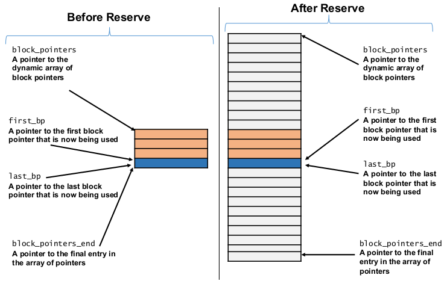

[\<- 02/23](02-23.md)

---

# STL deque Class

## A Possible Data Structure for the STL deque Class

|Member Name       |Description|
|------------------|-----------|
|block_pointers    |A pointer to the dynamic array of block pointers|
|first_bp          |A pointer to the first block pointer that is now being used|
|last_bp           |A pointer to the last block pointer that is now being used|
|block_pointers_end|A pointer to the final entry in the array of block pointers|
|front_ptr         |A pointer to the front element of the whole deque|
|back_ptr          |A pointer to the back element of the whole deque|

- The private member pointers might be declared in this way:

```
//Number of value_type items in each block
static const size_t block_size = 5;
//The elements in the deque
typedef int value_type;
//A pointer to a dynamic array of value_type items
typedef value_type* vtp;

//A pointer to the dynamic array of block pointers
vtp* block_pointers;
//A pointer to the final entry in the array of block pointers
vtp* block_pointers_end;

//A pointer to the first block pointer that's now being used
vtp* first_bp;
//A pointer to the last block pointer that's now being used
vtp* last_bp;

vtp front_ptr; //A pointer to the front element of the whole deque
vtp back_ptr;  //A pointer to the back element of the whole deque
```

## Pointer Arithmetic used in the Implementation of the deque Class

- Use pointer arithmetic in the implementation:
	- If `p` is a pointer into an array and `n` is an integer, then the expression `p+n` gives a new pointer that is `n` elements beyond `*p`
	- In this case, the expression `++p` changes `p` so that it points to the next element in the array, and `--p` changes `p` so that it points to the previous element
	- If `p` and `q` are both pointers into the same array, then the expression `q - p` gives an integer that indicates the distance between `q` and `p`
- Example: If `*q` is the element after `*p`, then `q - p = 1`

## Constructor

```
template <class Item>
deque<Item>::deque(int init_bp_array_size, int init_block_size){
	bp_array_size = init_bp_array_size;
	block_size = init_block_size;

	//set a pointer the start of the array of block pointers
	block_pointers = new value_type* [bp_array_size];

	for(size_type index = 0; index < bp_array_size; ++index){
		block_pointers[index] = NULL;
	}

	//set a pointer the end of the array of block pointers
	block_pointers_end = block_pointers + (bp_array_size - 1);

	first_bp = last_bp = NULL;
	front_ptr = back_ptr = NULL;
}
```

## Destructor

```
template <class Item>
deque<Item>::~deque(){
	for(size_type index = 0; index < bp_array_size; ++index){
		if(block_pointers[index] != NULL) delete [] block_pointers[index];
	}

	delete [] block_pointers;

	first_bp = last_bp = NULL;
	block_pointers_end = block_pointers = NULL;
	front_ptr = back_ptr = NULL;
}
```

## Clear

```
template <class Item>
void deque<Item>::clear(){
	for(size_type index = 0; index < bp_array_size; ++index){
		delete [] block_pointers[index];
		block_pointers[index] = NULL;
	}

	first_bp = last_bp = NULL;
	front_ptr = back_ptr = NULL;
}
```

## pop_back

- **case 1**: `if(back_ptr == front_ptr)`
- **case 2**: `else if(back_ptr == *last_bp)`
- **case 3**: `else`

### Case 1:

- There is just one block with just one element, so delete it, and reset things back to the start

```
void mydeque::pop_back(){
	//An empty deque has a NULL back_ptr:
	assert(back_ptr != NULL);

	if(back_ptr == front_ptr){
		clear();
	}
}
```

### Case 2

- `back_ptr` is pointing to the first element of the last block in the deque:
	- Remove the entire last block. Note that this will call the destructor for each item in the block: `delete [] back_ptr;`
	- The last block pointer that we are using is now one spot earlier in the array of block pointers: `--last_bp;`
	- The new back element is now the last element in the last block

```
else if (back_ptr == *last_bp){
	delete [] *last_bp;
	*last_bp = NULL;
	--last_bp;
	back_ptr = (*last_bp) + (BLOCK_SIZE - 1);
}
```

### Case 3

- The element we are removing is not the only element in its block, so we just move the `back_ptr` backward

```
else{
	--back_ptr;
}
```

## Reserve

- To increase the size of the deque (i.e., `reserve` function)
	- We plan to increase the size of the deque by `20 * BLOCK_SIZE`
	- Therefore, we need to increase the size of the array of block pointers by 20
	- We also copy the existing array of block pointers to the middle of the new array of block pointers to improve the flexibility of adding at the two ends of the deque



### Increasing the Size of deque

- Using the above diagram in this example

```
offset_first_bp = first_bp - block_pointers = 3
offset_last_bp = last_bp - block_pointers = 3
```

- Start of copying the original array: `block_pointers + 10 + offset_first_bp`
- End of copying the original array: `block_pointers + 10 + offset_last_bp`

```
template <class Item>
void deque<Item>::reserve(){
	size_type newSize = bp_array_size + 20;
	value_type** new_block_pointers = new value_type* [newSize];

	for(size_type index = 0; index < newSize; ++index){
		new_block_pointers[index] = NULL;
	}

	size_type offset_first_bp = first_bp - block_pointers;
	size_type offset_last_bp = last_bp - block_pointers;

	std::copy(first_bp, last_bp + 1, new_block_pointers + 10 + offset_first_bp);

	delete [] block_pointers;

	block_pointers = new block_pointers;
	bp_array_size = newSize;
	block_pointers_end = block_pointers + bp_array_size - 1;
	first_bp = block_pointers + offset_first_bp + 10;
	last_bp = block_pointers + offset_last_bp + 10;
}
```

## Iterator Invalidation Rules for STL's deque

- Note that an iterator pointing to an item of a deque cannot be implemented by only using a pointer to an item
- The iterator needs to know which array it is part of, and where the index is, so it can find the next/previous arrays

### Insertion:

- All iterators and references are invalidated because existing elements must be shifted
- If inserted member is at the front or back of the deque, all iterators are invalidated, but references to elements are unaffected
	- It fills out the first/last array, and then adds another one when necessary, so it never needs to move *existing* elements
	- However, the index vector might be copied and reallocated when resized

### Erasure

- All iterators and references are invalidated, unless the erased members are at the front or back of the deque (in which case only iterators and references to the erased members are invalidated)

## Iterator Example

### Not Compliant

```
void f(const double *items, std::size_t count){
	std::deque<double> d;
	deque::iterator<double> pos = d.begin();
	for(std::size_t i = 0; i < count; ++i, ++pos){
		d.insert(pos, items[i] + 41.0);
	}
}
```

### Compliant

```
void f(const double *items, std::size_t count){
	std::deque<double> d;
	deque::iterator<double> pos = d.begin();
	for(std::size_t i = 0; i < count; ++i ,++pos){
		pos = d.insert(pos, items[i] + 41.0);
	}
}
```

## Another Example

```
//inserting into a deque
#include <iostream>
#include <deque>
#include <vector>

int main(){
	std::deque<int> mydeque;

	//set some initial values:
	for(int i = 1; i < 6; i++) mydeque.push_back(i);      //1 2 3 4 5
	std::deque<int>::iterator it = mydeque.begin();
	++it;

	//it now points to the newly inserted 10
	it = mydeque.insert(it, 10);                          //1 10 2 3 4 5
	
	//it no longer valid!
	mydeque.insert(it, 2, 20);                            //1 20 20 10 2 3 4 5

	it = mydeque.begine()+2;
	std::vector<int> myvector(2, 30);
	mydeque.insert(it, myvector.begin(), myvector.end()); //1 20 30 30 20 10 2 3 4 5
	std::cout << "mydeque contains:";
	for(it = mydeque.begin(); it != mydeque.end(); ++it) std::cout << ' ' << *it;
	std::cout << '\n';
	return 0;
}
```

---

# Queue Applications

## Uses for Queues

- Queues are frequently used in simulation programs
	- Example: A program to simulate the traffic at an intersection might use a software queue to simulate the real-life situation of a growing line of automobiles waiting for a traffic light to change from red to green
- Queues also appear in computer system software, such as the operating system that runs on your PC
	- Example: For buffering input characters
- In a computer system in which more than one process or component uses a single resource, a queue is often used so that the processes or components wait in line and are served on a "first come, first served" basis

## Programming Example: Recognizing Palindromes

- Palindrome is a string that reads the same forward and backward
- Example: "radar" is a palindrome
- A more complicated example: "Able was I ere I saw Elba"
- Suppose we want a program to read a line of text and tell us if the line is a palindrome
- We can do this by using a stack and a queue
- We will read the line of text into both a stack and a queue, and then write out the contents of the stack and the contents of the queue
- The line that is written using the queue is written forward, and the line that is written using the stack is written backward
- Now, if those two output lines are the same, then the input string must be a palindrome

```
//FILE: pal.cxx
//Program to test whether an input line is a palindrome. Spaces, punctuation, and the difference between upper- and lowercase are ignored

#include <cassert>  //Provides assert
#include <cctype>   //Provides isalpha
#include <cstdlib>  //Provides EXIT_SUCCESS
#include <iostream> //Provides, cout, cin, peek
#include <queue>    //Provides the queue template class
#include <stack>    //Provides the stack template class
using namespace std;

int main(){
	queue<char> q;
	stack<char> s;
	char letter;
	queue<char>::size_type mismatches = 0; //Mismatches between queue and stack

	cout << "Enter a line and I will see if it's a palindrome:" << endl;
	while(cin.peek() != '\n'){
		cin >> letter;
		if(isalpha(letter)){
			q.push(toupper(letter));
			s.push(toupper(letter));
		}
	}

	while((!q.empty()) && (!s.empty())){
		if(q.front() != s.top());
			++mismatches;
		q.pop();
		s.pop();
	}

	if(mismatches == 0) cout << "That is a palindrome." << endl;
	else cout << "That is not a palindrome." << endl;

	return EXIT_SUCCESS;
}
```

- Sample Dialogues from the Palindrome Program

- First Sample Dialogue:

```
Enter a line and I will see if it's a palindrome:
Straw? No, too stupide a fad. I put soot on warts.
That is a palindrome.
```

- Second Sample Dialogue

```
Enter a line and I will see if it's a palindrome:
Able were you ere you saw Elba.
That is not a palindrome.
```

- Our program also ignores spaces and punctuation, requiring only that the letters on the line read the same forward and backward
- Example: You might not immediately recognize the following as a palindrome: "Straw? No, too stupide a fad. I put soot on warts."
- Our program ignores blanks and punctuation, so, according to our program, the above is a palindrome
- The function, called `isalpha`, returns true if its single argument is one of the alphabetic characters
	- From `<cctype>`

## A-Steal job scheduling algorithm

- Implements task scheduling for a multiprocessor system
- The processor gets the first element from the deque
- When all its tasks are done:
	- Wait for more tasks
	- Get the last element from the deque of another processor and start executing

---

# Intro to Tree

- In computer science, trees are upside down, with the root at the top
- Has nodes, and branches

## Tree vs Graph

- Graph may be circular, doesn't necessarily have directions
- A tree is a graph, but a graph is not a tree
	- Graph is the general form of the tree

## Binary Tree

- Maximum of 2 branches
- Parents and children
	- Ancestors and descendents
- A tree can have subtrees
	- Any branch that you cut gives you a subtree
	- Structurally, a subtree is a tree

- Recursion is widely used on tree operations

### Complete Binary Tree

- All nodes are filled from left to right

### Full Binary Tree

- Every child node needs to be NULL or have 2 children
- Number of nodes is going to be `2^n` where `n` is the height of the tree

### Data Structure

- A binary tree node has three member variables
	- `data_type value`
	- `tree_node *left`
	- `tree_node *right`

- Need setters and getters
