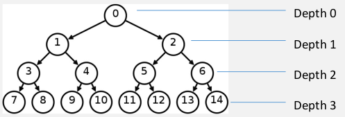
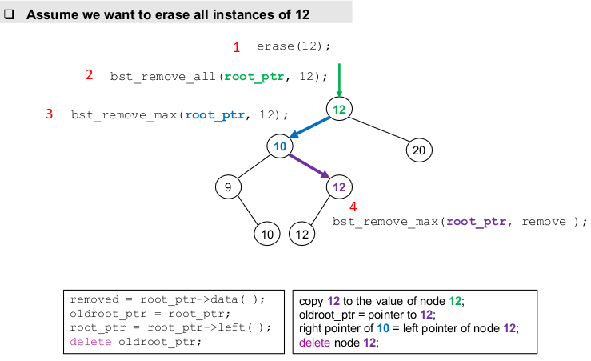

[\<- 02/25](02-25.md)

---

# Trees

- Chapter 10 introduces **trees**
- This presentation illustrates the simplest kind of trees: **Complete Binary Trees**

## Binary Trees

- A binary tree has **nodes**, similar to nodes in a linked list structure
- **Data** of one sort or another may be stored at each node
- But it is the **connections** between the nodes which characterize a binary tree

### Example: Binary Tree

- In the following tree, for example:
	- 3 is **parent** of 7
	- 7 and 8 are **siblings**
	- 3, 1, and 0 are the **ancestors** of 7
	- 7 is a **descendant** of 3
	- **Depth of node 7** is three
		- (Note: Depth of a tree with only root is 0, depth of an empty tree is -1)
	- **Depth of the tree** is three



## Terminology

|Term                   |Definition             |
|-----------------------|-----------------------|
|Parent                 |The parent of a node is the node linked above it|
|Sibling                |Two nodes are siblings if they have the same parent|
|Ancestor               |A node's parent is its first ancestor. The parent of the parent is the next ancestor. The parent of the parent of the parent is the next ancestor... and so forth, until you reach the root|
|Descendant             |A node's children are its first descendants. The children's children are its next descendants, ...|
|Subtree                |Any node in a tree in a tree also can be viewed as the root of a new, smaller tree|
|Left and right subtrees of a node|For a node in a binary tree, the nodes beginning with its left child and below are its left subtree; The nodes beginning with its right child and below are its right subtree|

## Full Binary Tree

- A full binary tree (sometimes **proper binary tree** or **2-tree**) is a tree in which every node other than the leaves has two children


## Complete Binary Tree

- A binary tree in which every level, except possibly the last, is completely filled, and all nodes are as far left as possible


## \# of Entries

- The minimum number of entries in a complete binary tree with depth `n` is `2^n`


## Binary Taxonomy Tree

- You start at the root, and ask the question that is written there
- If the answer is 'yes', you move to the left child
- If the answer is 'no', you move to the right child


## Tree Representation

- In a **complete binary tree:**
	- All of the depths are full, except perhaps for the deepest
	- At the deepest depth, the nodes are as far left as possible
- The representation can use:
	- A **fixed-size array** which means that the size of the data structure is fixed during compilation, and during execution it does not grow larger or smaller
	- A **dynamic array** allowing the representation to grow and shrink as needed during the execution of a program

### Array Representation


- `Parent(i) = floor((i-1)/2)`
- `Left child(i) = 2i+1`
- `Right child(i) = 2i+2`
- `Left sibling(i) = i-1 if i is even`
- `Right sibling(i) = i+1 if i is odd and i+1 <= n`

### Representing with a Class for Nodes

- Each node is stored in an object of a new `binary_tree_node`
- Each node contains pointers that link it to other nodes
- An entire tree is represented as a pointer to the root node

```
template <class Item>
class binary_tree_node{
	private:
		Item data_field;
		binary_tree_node *left_field;
		binary_tree_node *right_field;
};
```

### Example


### Member Functions

```
//MODIFICATION MEMBER FUNCTIONS
Item& data() { return data_field; };
binary_tree_node* left() { return left_field; };
binary_tree_node* right() { return right_field; };

void set_data(const Item& new_data) { data_field = new_data; };
void set_left(binary_tree_node* new_left) { left_field = new_left; };
void set_right(binary_tree_node* new_right) { right_field = new_right; };

//CONST MEMBER FUNCTIONS
const Item& data() const { return data_field; };
const binary_tree_node* left() const { return left_field; };
const binary_tree_node* right() const { return right_field; };

bool is_leaf() const { return (left_field == NULL) && (right_field == NULL); };
```

### Non-Member Functions

```
//NON-MEMBER FUNCTIONS for the binary_tree_node<Item>:
template <class Process, class BTNode>
void inorder(Process f, BTNode* node_ptr);

template <class Process, class BTNode>
void preorder(Process f, BTNode* node_ptr);

template <class Process, class BTNode>
void postorder(Process f, BTNode* node_ptr);

template <class Item, class SizeType>
void print(binary_tree_node<Item>* node_ptr, SizeType depth);

//Returning nodes to the heap (Implementation will be explained)
template <class Item>
void tree_clear(binary_tree_node<Item>*& root_ptr);

//Copying a tree (Implementation will be explained)
template <class Item>
binary_tree_node<Item>* tree_copy(const binary_tree_node<Item>* root_ptr);

template <class Item>
std::size_t tree_size(const binary_tree_node<Item>* node_ptr);
```

### Returning Nodes to the Heap: tree_clear

```
template <class Item>
void tree_clear(binary_tree_node<Item>*& root_ptr);
//Precondition: root_ptr is the root pointer of a binary tree (which may be NULL for the empty tree)
//Postcondition: All nodes at the root or below have been returned to the heap, and root_ptr has been set to NULL
```

- It is a non-member function
- Implementation through a recursive algorithm:
	1. Clear the left subtree
	2. Clear the right subtree
	3. Return the root node to the heap
	4. Set the root pointer to NULL

### Deletion Order in tree_clear

```
template <class Item>
void tree_clear(binary_tree_node<Item>*& root_ptr){
	//Library facitilites used: cstdlib

	binary_tree_node<Item>* child;
	if(root_ptr != NULL){
		child = root_ptr->left();
		tree_clear(child);

		child = root_ptr->right();
		tree_clear(child);

		delete root_ptr;
		root_ptr = NULL;
	}
}
```


### Copying a Tree: tree_copy

```
template <class Item>
binary_tree_node<Item>* tree_copy(const binary_tree_node<Item>* root_ptr);
//Precondition: root_ptr is the root pointer of a binary tree (which may be NULL for the empty tree)
//Postcondition: A copy of the binary tree has been made, and the return value is apointer to the root of this copy
```

- Through a recursive algorithm:
	1. Make `l_ptr` point to a copy of the left subtree
	2. Make `r_ptr` point to a copy of the right subtree
	3. `return new binary_tree_node(root_ptr->data(), l_ptr, r_ptr)`

```
template <class Item>
binary_tree_node<Item>* tree_copy(const binary_tree_node<Item>* root_ptr){

	binary_tree_node<Item>* l_ptr;
	binary_tree_node<Item>* r_ptr;

	if(root_ptr == NULL) return NULL;
	else{
		l_ptr = tree_copy(root_ptr->left());
		r_ptr = tree_copy(root_ptr->right());
		return new binary_tree_node(root_ptr->data(), l_ptr, r_ptr);
	}
}
```

### Exercise

- How many times the `tree_clear` function is invoked when we delete the following tree?
	- 7 (bc including the NULL children of the leafs)


- How many times the `tree_copy` function is invoked when we make a copy of the above tree?
	- ditto the above answer

---

# Tree Traversals

- Tree traversal: Processing all the nodes in a tree
- For a binary tree, there are three common ways of traversal:
	- **pre-order traversal**
	- **in-order traversal**
	- **post-order traversal**

## Pre-Order Traversal

1. Process the root
2. Process the nodes in the left subtree with a recursive call
3. Process the nodes in the right subtree with a recursive call


```
template <class Item>
void preorder_print(const binary_tree_node<Item>* node_ptr){
	//Precondition: node_ptr is a pointer to a node in a binary tree (or node_ptr may be NULL to indicate the empty tree)
	//Postcondition: If node_ptr is non-NULL, then the data of *node_ptr and all its descendants have been written to cout with the << operator, using a pre-order traversal

	if(node_ptr != NULL){
		std::cout << node_ptr->data)_ << std::endl;
		preorder_print(node_ptr->left());
		preorder_print(node_ptr->right());
	}
}
```

## In-Order Traversal

1. Process the nodes in the left subtree with a recursive call
2. Process the root
3. Process the nodes in the right subtree with a recursive call


```
template <class Item>
void inorder_print(const binary_tree_node<Item>* node_ptr){
	if(node_ptr != NULL){
		inorder_print(node_ptr->left());
		std::cout << node_ptr->data)_ << std::endl;
		inorder_print(node_ptr->right());
	}
}
```

- Note: Another type of in-order traversal: Backward In-order Traversal
	1. Process the nodes in the right subtree with a recursive call
	2. Process the root
	3. Process the nodes in the left subtree with a recursive call

## Post-Order Traversal

1. Process the nodes in the left subtree with a recursive call
2. Process the nodes in the right subtree with a recursive call
3. Process the root


```
template <class Item>
void postorder_print(const binary_tree_node<Item>* node_ptr){
	if(node_ptr != NULL){
		postorder_print(node_ptr->left());
		postorder_print(node_ptr->right());
		std::cout << node_ptr->data)_ << std::endl;
	}
}
```

## Parameters can be a Function

- In general, we would like to be able to do any kind of processing during tree traversal - not just printing

- We can just replace the `cout` statement in the traversal function with some other form of processive
	- This is very inefficient: We need to develop a new function for each type of processing

- It is possible to write just one function that is capable of doing a tree traversal and carrying out virtually any kind of processing at the nodes

- Example: A function called `apply`, with three arguments
	- A `void` function `f`
	- An array of integers called `data`
	- A `size_t` value called `n`, indicating the number of components in the array

```
void apply(void f(int&), int data[], size_t n);
```

- The power of the `apply` function comes frmo the fact that its first argument can be any `void` functino with a single integer reference parameter

```
void apply(void f(int&), int data[], size_t n){
	size_t i;
	for(i = 0; i < n; ++i){
		f(data[i]);
	}
}
```

- Obtaining more generality: The component type of the array is specified by the template parameter

```
template <class Item, class SizeType>
void apply(void f(Item&), Item data[], SizeType n){
	size_t i;
	for(i = 0; i < n; ++i){
		f(data[i]);
	}
}
```

- Currently, the first argument to the apply function must have the form: `void f(Item&);`
	- The return type is void, and the parameter type is a reference to Item
- Precludes many function that we might want to use
- For example, `f` cannot have a value parameter (it must have a *reference* parameter)

- Obtaining more generality:
	- We add the third template parameter
	- The component type of the first argument is specified by a template parameter

```
template <class Process, class Item, class SizeType>
void apply(Process f, Item data[], SizeType n){
	size_t i;
	for(i = 0; i < n; ++i){
		f(data[i]);
	}
}
```

- Sample functions that can be used with the `apply` function:
	- `void triple(int& i); //Postcondition: i has been multiplied by three`
	- `void print(int i); //Postcondition: i has been printed to cout`
	- `void print(const string& s); //Postcondition: s has printed to cout`

- A sample code that passes function `printValue` to the `apply` function

```
int main(){
	int array1[] = {0, 1, 2, 3, 4};
	apply(printValue, array1, 5);
	return 0;
}
```

## Template Functions for Tree Traversals

- This template function will apply a function `f` to all the items in a binary tree, using a pre-order traversal:

```
template <class Process, class BTNode>
void preorder(Process f, BTNode* node_ptr){
	//Precondition: node_ptr is a pointer to a node in a binary tree (or node_ptr may be NULL to indicate the empty tree)
	//Postcondition: If node_ptr is non-NULL, then the function f has been applied to the contents of *node_ptr and all of its descendantsm using a pre-order traversal
	//Node: BTNode may be a binary_tree_node or a const binary tree node
	//Process is the type of a function f that may be called with a single Item argument (using the Item type from the node)

	if(node_ptr != NULL){
		f(node_ptr->data());
		preorder(f, node_ptr->left());
		preorder(f, node_ptr->right());
	}
}
```

- We don't even need to know exactly what `f` does

---

# Binary Search Trees

## Properties of Binary Search Trees

- Binary trees offer an improved way of **implementing the bag class**
- This implementation requires that the bag's entries can be compared with the usual comparison operators `<`, `>`, `==`, and so on
- These operators must form a strict weak ordering
	- Reminder: A Strict Weak Ordering has to behave the way that "less than" behaves
- Tak advantage of the order to store items in the nodes of a binary tree, using a strategy that will make it easy to find items

- **Binary Search Tree (BST) Storage Rules**
	- The entry in node `n` is never less than an entry in its left subtree (though it may be equal to one of these entries)
	- The entry in node `n` is less than every entry in its right subtree

- BSTs also can store a collection of strings, or real numbers, or **anything that can be compared using some sort of less-than comparison**
- This provides higher efficiency (`O(log(n))`) compared to the implementations using array or linked-list (`O(n)`)
- The higher efficiency of searching in a BST motivates us to implement the bag class with a BST

- With a binary search tree, searching for an entry is often much quicker


## Implementing the Bag Class with a Binary Search Tree

- **Invariant for the Sixth Bag:**
	- The items in the bag are stored in a binary search tree
	- The root pointer of the binary search tree is stored in the member variable `root_ptr` (which may be NULL for an empty tree)

```
template <class Item>
class bag{
	public:
		// Prototypes of public member functions go here

	private:
		binary_tree_node<Item> *root_ptr; //Root pointer
};
```

### The count member function

- The `count` member function counts the number of occurrences of an item called `target`

```
template <class Item>
typename bag<Item>::size_type bag<Item>::count(const Item& target) const{
	size_type answer = 0;
	binary_tree_node<Item> *cursor;

	cursor = root_ptr;
	//TODO Use a loop to move the cursor down through the tree, always moving along the path where the target might occur

	return answer;
}
```

- At each point in the tree we have four possibilities:
	1. The `cursor` can become NULL: End the loop and return
	2. data > target: The target can appear only in the left subtree
		- `cursor = cursor->left()`
	3. data < target
		- `cursor = cursor->right()`
	4. data = target
		- Add one to `answer`
		- Continue the search to the left (since items to the left are less than or equal to the item at the cursor node)

- Assume we want to count number of occurrences of 53:


- Consider the task of inserting 16:


### The insert member function

- Adds a new item to a binary search tree
	- `void insert(const Item& entry)`

- **Case 1**: First handle this special case: When **the first entry is inserted**, simply call `root_ptr = new binary_tree_node<Item>(entry)`
- **Case 2**: There are already some other entries in the tree:
	- We pretend to search for the exact entry that we are trying to insert
	- We stop the search just before the cursor falls off the bottom of the tree, and we insert the new entry at the spot where the cursor was about to fall off

- Use a boolean variable called `done`, which is initialized to false
- Implement a loop that continues until `done` becomes true

```
template <class Item>
void bag<Item>::insert(const Item& entry){
	//Header file used: bintree.h

	if(root_ptr == NULL){ //When the tree is empty
		//Add the first node of the binary search tree
		root_ptr = new binary_tree_node<Item>(entry);
		return;
	}

	else{ //When the tree is not empty
		//Move down the tree and add a new leaf
		cursor = root_ptr;
		//TODO find the position to add the new entry, then add it
	}
}
```

- How to allow duplicates where every insertion inserts one more key with a value and every deletion deletes one occurrence?
- A **Simple Solution** is to allow same keys on the left side (we could also choose right side)
- For example consider insertion of keys 12, 10, 20, 9, 11, 10, 12, 12 in an empty Binary Search Tree


## The erase_one member function

- The `erase_one` member function: Remoes a specified item from a binary search tree
	- Prototype: `bool erase_one(const Item& target);`

- We implement the `erase_one` function with two auxiliary functions to reduce the complexity of implementation

```
template <class Item>
bool bag<Item>::erase_one(const Item& target){
	return bst_remove(root_ptr, target);
}

template <class Item>
bool bst_remove(binary_tree_node<Item>*& root_ptr, const Item& target);

template <class Item>
void bst_remove_max(binary_tree_node<Item>*& root_ptr, Item& removed);
```

### bst_remove

```
template <class Item>
bool bst_remove(binary_tree_node<Item>*& root_ptr, const Item& target);

//Precondition: root_ptr is a root pointer of a binary search tree (or may be NULL for the empty tree
//Postcondition: If target was in the tree, then one copy of target has been removed, root_ptr now points to the root of the new (smaller) binary search tree, and the function returns true. Otherwise, if target was not in the tree, then the tree is unchanged, and the function returns false

template <class Item>
bool bst_remove(binary_tree_node<Item>*& root_ptr, const Item& target){
	binary_tree_node<Item> *oldroot_ptr;

	if(root_ptr == NULL) return false;

	if(target < root_ptr->data()) return bst_remove(root_ptr->left(), target); //target not yet found
	if(target > root_ptr->data()) return bst_remove(root_ptr->right(), target); //target not yet found
	
	if(root_ptr->left() == NULL){
		...
		return true;
	}

	bst_remove_max(root_ptr->left(), root_ptr->data());

	return true;
}
```

- Employs a recursive implementation to remove the target
- Handles these cases:
	1. Empty tree: return
	2. The target < root entry: make a recursive call to delete the target from the left subtree
	3. The target > root entry: make a recursive call to delete the target from the right subtree
	4. The target = root entry
		- Case a) The root node has no left child
		- Case b) The root node does have a left child

**The root node has no left child**:

- We can delete the root entry and make the right child the new root node

```
oldroot_ptr = root_ptr;
root_ptr = root_ptr->right();
delete oldroot_ptr;
```

- This scheme also works properly if there is no right child

**The root node does have a left child**:

- If there is no right child, then the left child can become the new root
	- What if it has a right child? We need a better solution...

- We need to find the largest entry in the left subtree and remove it

- We want to design a more general solution
	- To find some entry in the non-empty left subtree, and move this entry up to the root
	- This case works even when the node to be deleted has a right child
- Questino: How to find this entry?

### bst_remove_max

```
template <class Item>
void bst_remove_max(binary_tree_node<Item>*& root_ptr, Item& removed);

//Precondition: root_ptr is a root pointer of a non-empty binary search tree
//Postcondition: The largest item in the binary search tree has been removed, and root_ptr now points to the root of the new (smaller) binary search tree. The reference parameter, removed, has been set to a copy of the removed item
```

- Implementing the `bst_remove_max` function: Cases
	1. No right child: The largest item is at the root, so you can set `removed` equal to the data from the root, move the root pointer down to the left, and delete the root node
	2. There is a right child: There are larger items in the right subtree. In this case, make a recursive call to delete the largest item from the right subtree


## The erase member function

- The `erase` member function: Removes all the occurrences of an item from a binary search tree
	- Prototype: `bool erase(const Item& target)`

```
template <class Item>
bool bag<Item>::erase(const Item& target){
	return bst_remove_all(root_ptr, target);
}

template <class Item>
bag<Item>::size_type bst_remove_all(binary_tree_node<Item>*& root_ptr, const Item& target);

template <class Item>
void bst_remove_max(binary_tree_node<Item>*& root_ptr, Item& removed);
```

### bst_remove_all

```
template <class Item>
typename bag<Item>::size_type bst_remove_all(binary_tree_node<Item>*& root_ptr, const Item& target){
	binary_tree_node<Item> *oldroot_ptr;

	if(root_ptr == NULL) return 0;

	if(target < root_ptr->data()) return bst_remove_all(root_ptr->left(), target);
	if(target > root_ptr->data()) return bst_remove_all(root_ptr->right(), target);

	if(root_ptr->left() == NULL){
		...
		return 1;
	}

	bst_remove_max(root_ptr->left(), root_ptr->data());

	return 1 + bst_remove_all(root_ptr, target);
}
```



```
if(root_ptr->left() == NULL){
	//Target was found and there is no left subtree, so we can remove this node, amking the right child be the new root
	oldroot_ptr = root_ptr;
	root_ptr = root_ptr->right();
	delete oldroot_ptr;
	return 1;
}
```


## The += member function

```
template <class Item>
void bag<Item>::operator +=(const bag<Item>& addend){
	if(root_ptr = addend.root_ptr){ //b += b
		bag<Item> copy = addend;
		insert_all(copy.root_ptr);
	}

	else insert_all(addend.root_ptr); //b += c
```

- Benefits from an auxiliary function `insert_all`
- `insert_all` is actually another bag member function
- The `insert_all` member function:

```
template <class Item>
void bag<Item>::insert_all(binary_tree_node<Item>* addroot_ptr){
	//Precondition: addroot_ptr is the root pointer of a binary search tree that is separate from the binary search tree of the bag that activated this method
	//Postcondition: All the items from the addN's binary search tree have been added to the binary search tree of the bag that activated this method

	if(addroot_ptr != NULL){ //Explicity uses the pre-order traversal of the tree
		insert(addroot_ptr->data());
		insert_all(addroot_ptr->left());
		insert_all(addroot_ptr->right());
	}
}
```

### insert_all

- We could also use the post-order traversal
- Avoid in-order because:
	- The nodes of the addend tree will be processed in order from smallest to largest
	- These nodes will be inserted into the other bag from smallest to largest
	- The resulting tree ends up with a single long, narrow path, with only right children
	- Searching and other algorithms are inefficient when the trees lose their branching structure

## Summary

- Trees are a nonlinear structure
- Applications such as:
	- Organizing information (such as taxonomy trees)
	- Implementing an efficient version of the bag class (using binary search trees)
- Trees may be implemented with:
	- Fixed-size arrays: Appropriate for complete binary trees
	- Dynamic data structures
- A tree traversal consists of processing a tree by applying some action to each node
	- Using parameters that are functions, we can write extremely flexible tree traversals
- Binary search trees are one common application of trees
	- Permit us to store a bag of ordered items in a manner where adding, deleting, and searching for entries is potentially much faster with a linear structure
- Operations on trees are good candidates for recursive thinking
	- Because many tree operations include a step to process one or more sub-trees, and this step is "a smaller version of the same problem"

---

[03/09 ->](03-09.md)
