[\<- 03/02](03-02.md)

# Balanced Trees

## Heaps

### Heap Storage Rules

- **A binary tree where the entries of the nodes can be compared with the less-than operator of a strict weak ordering**
- In addition:
	- Heap is **a complete binary tree**, so that every level except the deepest must contain as many nodes as possible; and at the deepest level all the nodes are as far left as possible
	- A **max-heap** is a **complete binary tree** in which the value in each internal node is greater than or equal to the values in the children of that node
	- A **min-heap** is defined similarly

### Heap Storage Rules

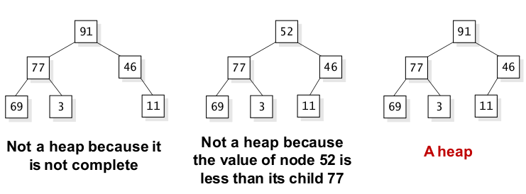

- A heap can be implemented with the binary tree nodes
- As heap is a complete binary tree, **it can be easily implemented as an array**
	- A fixed size array if we know the maximum size
	- A dynamic array to grow and shrink the size

### The Priority Queue with Heaps

- In a **priority queue**:
	- Entries are placed in the queue and later taken out
	- Each entry in a priority queue can be compared with the other entries using a less-than operator
	- The highest priority entries always leave first

- In the heap implementations of a priority queue:
	- Each node of the heap contains one entry
	- Each entry can be compared to each of the other entries by the less-than operator

### Adding an Entry to a Heap

- Pseudocode for **adding an entry**
	1. **Place the new entry in the heap in the first available location**. This keeps the structure as a complete binary tree, but it might no longer be a heap since the new entry's parent might be less than the new entry
	2. **while (the new entry's parent is less than the new entry)** swap the new entry with its parent

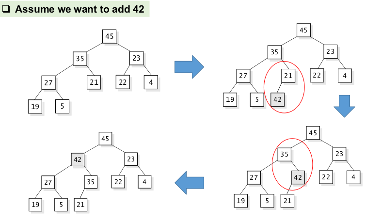

- **Re-heapification Upward**:
	- The "new entry rising" stop when the new entry has a parent with a higher or equal priority, or when the new entry reaches the root

### Removing an Entry from a Heap

- **Always remove the entry with the highest priority**: The entry that stands "on top of the heap"
- Pseudocode for Removing an Entry
	1. Copy **the entry at the root** of the heap to the variable that is used to return a value
	2. Copy the **last entry in the deepest level to the root**, and then take this last node out of the tree; This entry is called the "out-of-place" entry
	3. while (the out-of-place entry is less than one of its children) swap the out-of-place entry with its highest child
	4. Return the answer that was saved in step 1

### Adding an Entry to a Heap

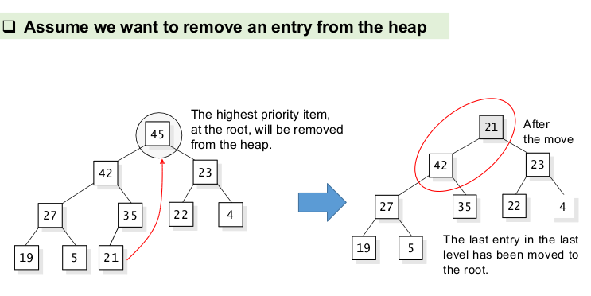
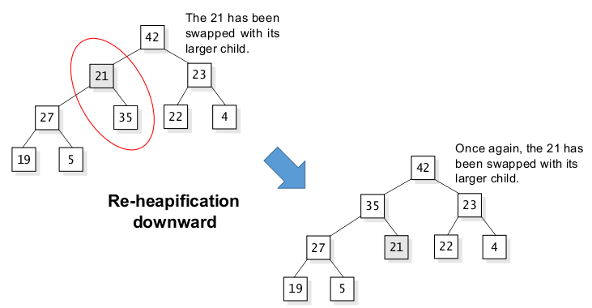

---

# The STL Priority Queue and the Heap Algorithms

## Heaps

### The STL Priority Queue

- The STL includes a priority queue class

```
template <class T, class Container = std::vector<T>, class Compare = std::less<typename Container::value_type>>
class priority_queue;
```

- `T`
	- Type of the elements

- `Container`
	- Type of the internal *underlying container* object where the elements are stored

- `Compare`
	- A binary predicate that takes two elements (of type `T`) as arguments and returns a `bool`

- The container:
	- May be any of the standard container class templates or some other specifically designed container class
	- Shall be accessible through random access iterators and support the following operations: `empty()`, `size()`, `front()`, `push_back()`, `pop_back()`
- The standard container classes `vector` and `deque` fulfill these requirements

- Some Member functions:
	- `pop()`: Removes the **highest priority** item of the priority queue
	- `push(const Item& entry)`: Adds an item to the priority queue
	- `top()`: Returns the **highest priority** item of the queue (without removing it)

- **Note**: The `top()` prototype is: `const value_type& top() const;`
	- It cannot be used to change the top item
	- The `top()` member function effectively calls member `front` of the underlying container object

```
#include <iostream> //std::cout
#include <queue>    //std::priority_queue

int main(){
	std::priority_queue<int> mypq;

	mypq.push(30);
	mypq.push(100);
	mypq.push(25);
	mypq.push(40);

	std::cout << "Popping out elements...";
	while(!mypq.empty()){
		std::cout << ' ' << mypq.top();
		mypq.pop();
	}
	std::cout << '\n';
	
	return 0;
}

---
Output:
Popping out elements... 100 40 30 25
```

---

# AVL Tree

## The Problem of Unbalanced Trees

- Assume we add 1,2,3,4 and 5 to a **binary search tree**

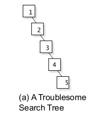

- We are no better off than the linked-list implementation

- BST's worst-case performance is closest to linear search algorithms, that is O(n)
- As we cannot predict data pattern and their frequencies, a need arises to balance out the existing BST
- An AVL tree is a **self-balancing** binary search tree
	- The first invented self-balancing tree
- **The heights of the two child subtrees of any node differ by at most one**
- If at any time they differ by more than one, rebalancing is done to restore this property
- Lookup, insertion, and deletion all take O(log(n)) time in both the average and worst cases
- Insertions and deletions may require the tree to be rebalanced **by one or more tree rotations**

## Balance Factor

- The **Balance Factor** of node `n` is defined as

```
BalanceFactor(n) = Height(LeftSubtree(n)) - Height(RightSubtree(n))
```

- A binary tree is called **AVL tree** if the following invariant holds for every node `n` in the tree:
	- -1 <= BalanceFactor(n) <= 1

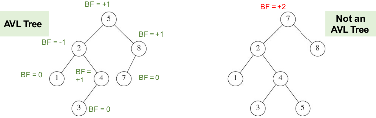

## Rotation

- An AVL tree may perform the following four kinds of rotations to balance itself:
	- Left rotation (single rotation)
	- Right rotation (single rotation)
	- Left-Right rotation (double rotation)
	- Right-Left rotation (double rotation)

### Left Rotation

- If a tree becomes unbalanced, when a node is inserted into the **right subtree of the right subtree**
- Left rotation: Swaps the parent node with its right child

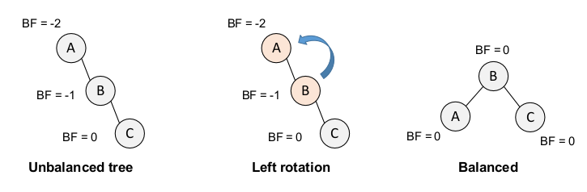

```
template <class Item>
binary_tree_node<Item>* left_rotation(binary_tree_node<Item>*& parent){
	binary_tree_node<Item>* temp;
	temp = parent->right();
	parent->set_right(temp->left());
	temp->set_left(parent);
	return temp;
}
```

### Right Rotation

- If a tree becomes unbalanced, when a node is inserted into the **left subtree of the left subtree**
- Right rotation: Swaps the parent node with its left child

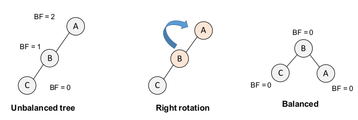

```
template <class Item>
binary_tree_node<Item>* right_rotation(binary_tree_node<Item>*& parent){
	binary_tree_node<Item>* temp;
	temp = parent->left();
	parent->set_left(temp->right());
	temp->set_right(parent);
	return temp;
}
```

### Left-Right Rotation

- A node has been inserted into the right ubstree of the left subtree
- Note: B < C < A -> C becomes the new parent

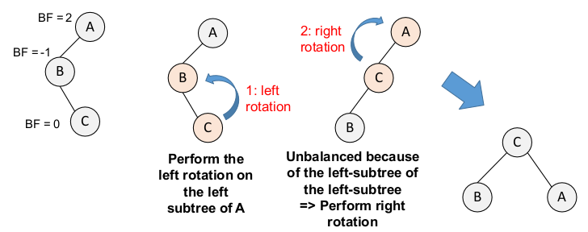

### Right-Left Rotation

- A node has been inserted into the left ubstree of the right subtree
- Note: A < C < B -> C becomes the new parent

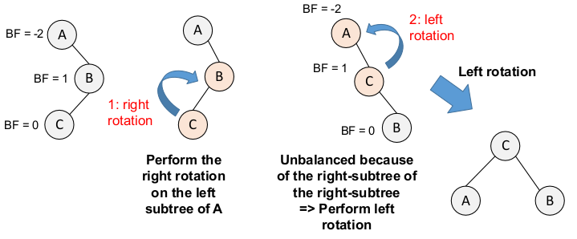

## Trees, Logs, and Time Analysis

- Both heap and AVL control the depth
- The worst-case time performance for the following operations are all O(d), where d is the depth of the tree:
	- Adding an entry in a binary search tree or a heap
	- Deleting an entry from a binary search tree or a heap
	- Searching for a specified entry in a binary search tree

### Time Analysis for Binary Search Tree

- A **BST** with `n` nodes has at most depth `n-1`
- Adding an entry, deleting an entry, or searching for an entry in a binary search tree with n entries is: O(d)
	- where d is the depth of the tree

### Time Analysis for Heaps

- Number of entries at level d is 2^d
- For a **heap** with d levels we need at least the following number of nodes: 2^d
- What is the maximum depth of a heap with `n` nodes?
	- A heap with depth d needs at least 2^d nodes, therefore: 2^d <= n, d <= log2(n)
- Adding or deleting an entry in a heap with n entries is O(d), where d is the depth of the tree
- The operations are O(log2(n))

### Logarithm Rules

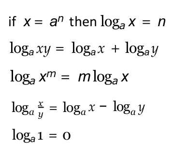

## Summary

- A **heap** is a complete binary tree that follows the rule that the entry at any node is never less than any of its children
	- Provides an efficient implementation of **priority queues**
- The STL includes a priority queue class as well as algorithms for building and manipulating heaps
- The tree algorithms that we have seen for binary search trees, heaps, and B-trees **all have worst-case time performance of O(d)**, where **d is the depth of the tree**
- The depth of a heap is never more than O(log(n)), where n is the number of nodes

---

# Appendix 1: The STL Multiset Class and Its Iterator

## The Multiset Template Class

- A **multiset** is an STL class similar to our bag, it permits a collection of items to be stored, **where each item may occur multiple times** in the multiset
- The value of an element also identifies (the value is itself the **key**) - the keys are used to order the items
- The elements in a multiset are always sorted following a specific strict weak ordering criterion indicated by its internal comparison object
- Sets and Multisets are typically implemented as **binary search trees**
- Another STL class, the **set** class, has the same interface as the multiset class, except that **it stores elements without repetition**, additional insertions of an element that is already in a set will have no effect
- A program that uses multisets or sets must include the header file `<set>`

---

# Inheritance

- Inheritance is the 4th principle of OOP
- In this presentation, we discuss abstract and derived classes and principles of inheritance

- One of the 4 major principles that make a language Object Oriented
	- Encapsulation, Data Abstraction, Polymorphism, **Inheritance**
- To create new classes that acquire some or many of their properties from an existing class
- The original class is called the **base class** and the new (slightly different?) class is the **derived class**

## Derived Classes

- Once we have a class, we can then declare new classes that **contain all of the member of the original class - plus any extras that you want to throw in**
- The members that the derived class receives from its base class are called **inherited members**

- Assume you write a clock class to keep track of a time value such as 9:48PM
- Now suppose you're writing a program with various kinds of clocks: 12-hour clocks, 24-hour clocks, alarm clocks, cuckoo clocks, and so on
	- For example, a `cuckoo_clock` might have an extra function, `is_cuckooing`, that returns true it its cuckoo bird is currently making noise
- One possible solution uses no new ideas: Modify the original clock definition by adding an extra member function
- **Even though all of these have similar or identical constructors and member functions, we'll still end up repreating the member function implementations for each different kind of clock**

- In the definition of the derived class, the name of the derived class is followed by a **single colon**, the keyword **public**, and then the **name of the base class**

```
class cuckoo_clock : public clock{
	...
}
```

- All of the public members of an ordinary clock are immediately available as public members of a `cuckoo_clock`

### Example

- A Derived Class Definition:

```
class cuckoo_clock : public clock{
	public:
		bool is_cuckooing() const;
};
```

- A Member Function Implementation:

```
bool cuckoo_clock::is_cuckooing() const{
	return (get_minute() == 0);
}
```

- Once the `cuckoo_clock` definition is available, a program may declare `cuckoo_clock` objects using all the public clock member functions and also using the new `is_cuckooing` function

## Public vs Private vs Protected

- We can use keyword **private** instead of **public**, resulting in a **private base class**
- With a private base class, all of the public members of an ordinary clock are immediately **available as private members** of a `cuckoo_clock`
- A **protected** member is like a private member, but it is also accessible by the children of the class

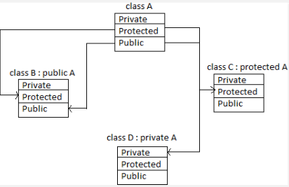

### Example

```
class clock {
	public:
		//...
		// CONSTANT FUNCTIONS
		int get_hour() const;
		int get_minute() const;
		bool is_morning() const;

	private:
		int my_hour;
		int my_minute;
		int my_morning;
};

class clock24 : private clock{
	public:
		int get_hour() const;
};

int main(){
	clock24 myClock1;
	cout << myClock1.get_hour() << endl;
	cout << myClock1.get_minute() << endl;
}
```

## Constructors for Derived Classes

- Same as any other class
	- Define it, or
	- Use default constructor and copy constructor
- This default constructor will carry out two steps
	1. **Activate the default constructor for the base class** (to initialize any member variables that the base class uses)
	2. **Activate default constructors for any new member variables that the derived class has**, but the base class does not have

### Example: Constructor Order

```
class clock {
	public:
		// CONSTRUCTOR
		clock(){
			my_hour = 12;
			my_minute = 0;
			my_morning = true;
			std::cout << "clock constructor!" << std::endl;
		};

	private:
		int my_hour;
		int my_minute;
		int my_morning;
};

class clock_design{
	public:
		clock_design(){
			color="brown";
			weight = 12;
			std::cout << "clock_design constructor!" << std::endl;
		}

	private:
		std::string color;
		int weight;
};

class clock24 : private clock{
	public:
		clock24(){
			std::cout << "clock24 constructor!" << std::endl;
		};
		
		//...

		private:
			clock_design design_spec;
};
```

### Copy Constructor

- If a derived class does not define a copy constructor of its own, then C++ will automatically provide a copy constructor
- This copy constructor is similar to the automatic default constructor in that it carries out two steps:
	1. **Activate the copy constructor for the base class (to copy any member variables that the base class uses)**
	2. **Activate copy constructors for any new member variables that the derived class has** but the base class does not have
- The copy constructors that are actiavted in Steps 1 and 2 may themselves by automatic copy constructors, or they may be specially written to accomplish correct copying of dynamic data structures

### Example: Assignment Operator

```
clock ordinary;
cuckoo_clock fancy1, fancy2;
fancy.advance(60);
ordinary = fancy1;
fancy2 = ordinary;
```

- So: what happens here?
	- The assignment `ordinary = fancy1` is **permitted** because a cuckoo clock (such as `fancy1`) can be used at any point where an ordinary `clock` is expected
	- An assignment in the other direction, `fancy2 = ordinary`, is **forbidden** because **an object of the base class (the ordinary clock) cannot be used as if it were an object of the derived class** (the cuckoo clock)

### Automatic Assignment Operator Limitation

- **Allowed**:
	- When a base class is public, an object of a derived class may be used as if it were an object of the base class

- **Forbidden**:
	- But an object of the base class cannot usually be used as if it were an object of the derived class

### Automatic Destructor

- If a class does not have a declared destructor, then C++ provides an automatic destructor that carries out two steps:
	1. **The destructors are called for any member variables that the derived class has**, but the base class does not have
	2. **The destructor is called for the base class**
- Notice that an automatic destructor works differently than an automatic constructor: **An automatic destructor first activates the destructors for member variables and then activates the destructor for the base class**
- But an automatic constructor first activates the constructor for the base class, and then activates the constructors for the member variables

## Overriding Inherited Members

- A derived class must sometimes perform some actions differently from the way the base class does
- Example:
	- The original clock provides the current hour via `get_hour` using a 12-hour clock
	- Suppose we want to implement a derived class that provides its hour on a 24-hour basis, ranging from 0 to 23
- The new clock can be defined as a derived class called `clock24`
- The `clock24` class inherits everything from the ordinary clock, but it provides a new `get_hour` member function
- This is called **overriding** an inherited member function

### Example 1

```
class clock24 : public clock{
	public:
		int get_hour() const; //Overriden from the clock class
};

int clock24::get_hour() const{
	int ordinary_hour;
	ordinary_hour = clock::get_hour();

	if(is_morning()){
		if(ordinary_hour == 12) return 0;
		else return ordinary_hour;
	}
	else ...
}
```

- When we write `clock::get_hour()`, we are activating the original clock's `get-hour` function

---

# Inheritance Tree

## Example

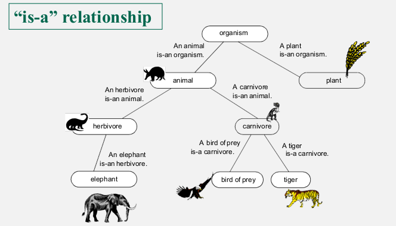

## Adding Private Members

- The animal class will have two new private member variables, which are not part of the organism class, as show in this partial definition:

```
class animal : public organism{
	public:
		//We discuss the animal's public members later
	private:
		double need_each_week;
		double eaten_this_week;
};
```

- When a derived class has some new member variables, **it will usually need a new constructor** to initialize those member variables

### Initializing Private Members

```
class animal : public organism{
	public:
		animal(double init_size = 1; double init_rate = 0; double init_need = 0);
}
```

- The work of the animal's constructor is easy enough to describe: The first two arguments must somehow initialize the size and growth rate of the `animal`; the last argument initializes `need_each_week`; the value of `eaten_this_week` is initialized to zero
- But how do we manage to use `init_size` and `init_rate` to initialize the size and growth rate of the animal?
- Most likely the size and growth rate are stored as private member variables of the `organism` class, but the animal has no direct access to the `organism`'s private member variables

### Member Initialization List

- This list is an extra line in the constructor of a derived class
- The purpose is to provide initialization, including a call to the constructor of the base class

```
animal::animal(double init_size, double init_rate, double init_seed) : organism(init_size, init_rate), need_each_week(init_need), eaten_this_week(0){
	//Because of the initialization list, this constructor has no work
}
```

### Derived Class Initialization

- The member initialization list appears in the implementation of a constructor, after the closing parenthesis of the parameter list
	- The list begins with a colon, followed by a list of items separated by commas
	- For a derived class, **the list can contain the name of the base class, followed by an argument list (in parentheses) for the base class constructor**
	- The list can also contain **any member variable** followed by its initial value in parentheses
	- When the derived class constructor is called, the member variables are initialized with the specified values and the constructor for the base class will be actiavted before anything else is done
	- If a base class constructor is not activated in the member initialization list, then the default constructor for the base class will automatically be activated before any of the rest of the derived class constructor is executed

### Example

```
class herbivore : public animal{
	// CONSTRUCTOR
	herbivore(double init_size = 1, double init_rate = 0, double init_need = 0);
	// MODIFICATION MEMBER FUNCTIONS
	void nibble(plant& meal);
};

herbivore::herbivore(double init_size, double init_rate, double init_need) : animal(init_size, init_rate, init_need){
	//No work is done here, except calling the animal constructor
}
```

---

[03/11 ->](03-11.md)
